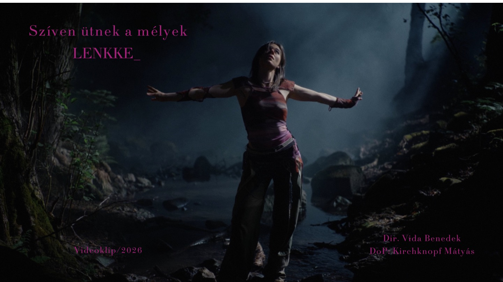
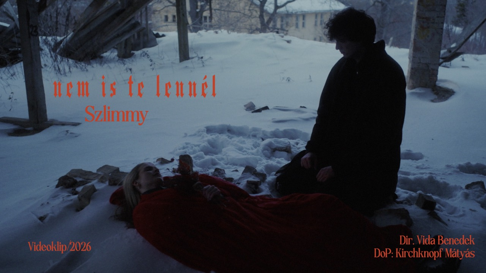
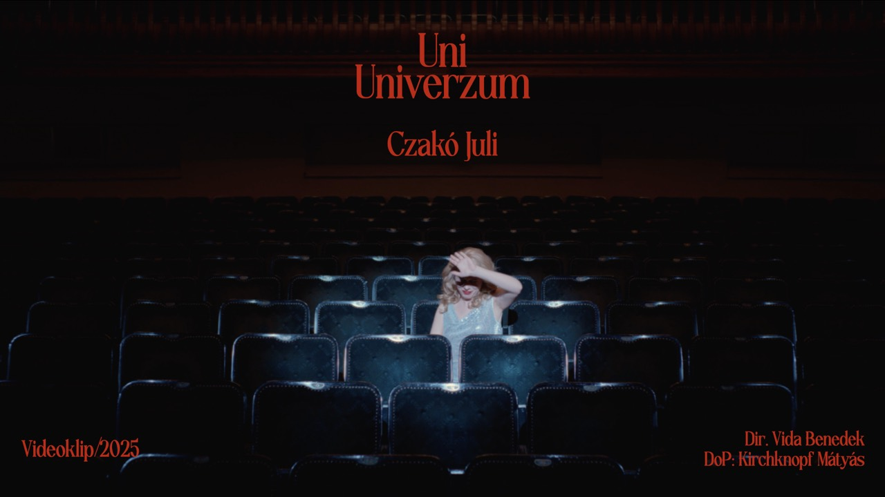
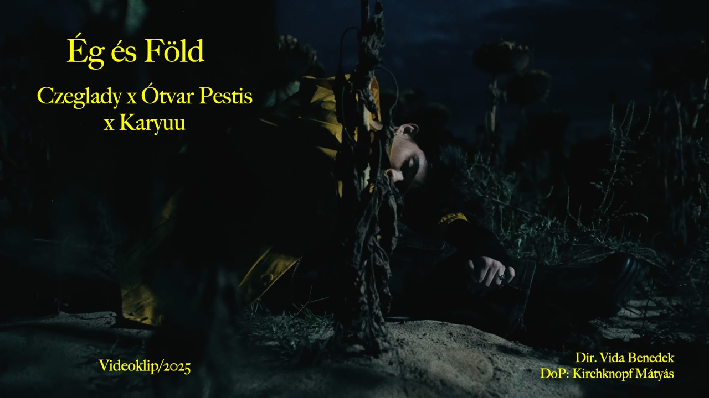
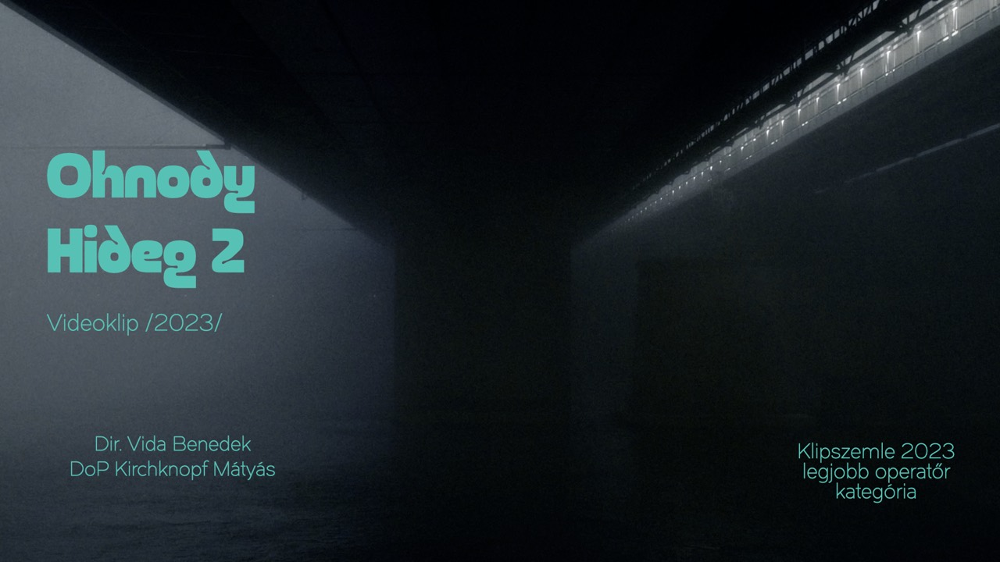
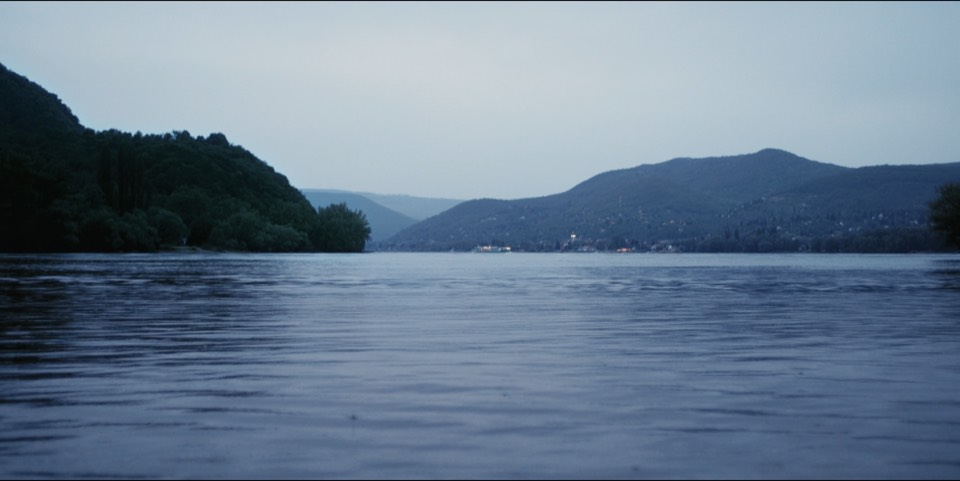
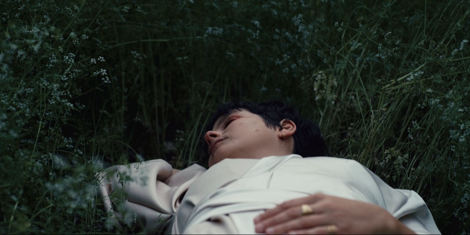
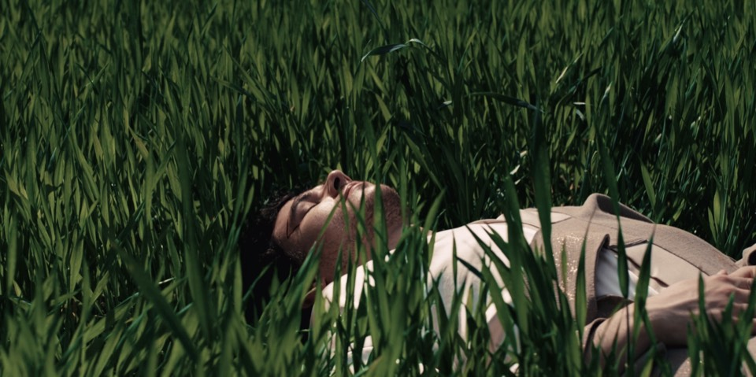

# Vida Benedek portfolio – ChatGPT fejlesztői csomag

Ezt a teljes fájlt másold be vagy töltsd fel a ChatGPT-be, majd írd le neki, mit szeretnél módosítani a weboldalon.

## Utasítás a ChatGPT számára

Egy statikus, GitHub Pages-en futó portfolio-weboldal teljes szöveges fejlesztői csomagját kapod meg. Segíts a felhasználónak beszélgetés közben megtervezni és elkészíteni a kért változtatásokat.

Fontos szabályok:

1. A publikus kezdőoldal az `index.html`. Az `elso-oldal.html` egy régi, megőrzött másolat, ezért nincs a csomagban és nem kell módosítani.
2. Nincs build rendszer és nincs keretrendszer. A webhely sima HTML, CSS és JavaScript, közvetlenül GitHub Pages-en fut.
3. Tartsd meg a meglévő reszponzív működést, akadálymentességet, SEO metaadatokat és a fájlok relatív elérési útjait.
4. Ne találj ki új kép- vagy videófájlnevet. Csak a lent felsorolt, már használt médiafájlokra hivatkozz, kivéve ha a felhasználó külön jelzi, hogy új fájlt fog adni.
5. Módosítás után csak a megváltozott fájlokat add vissza, de azokat teljes tartalommal. Ne használj `...`, „a többi változatlan” vagy más kihagyást.
6. Minden visszaadott fájl pontosan ezt a formátumot használja (a fájljelölő sorok a kódblokkon kívül legyenek):

<FILE path="styles.css">

~~~css
a teljes fájl tartalma
~~~

</FILE>

7. A kódblokkok után röviden sorold fel, mit változtattál. Ha a kérés nem egyértelmű, előbb kérdezz vissza, és csak utána generálj fájlokat.
8. A válaszod később egy kódoló asszisztenshez lesz bemásolva, amely a `<FILE path="...">` blokkok alapján alkalmazza és ellenőrzi a módosításokat.

## Projektfelépítés

- `index.html`: az élő főoldal és annak tartalma
- `showreel/index.html`: külön showreel aloldal
- `styles.css`: a teljes oldal és az aloldal közös megjelenése, reszponzív szabályokkal
- `script.js`: navigáció, animációk, videók, galéria és interakciók
- `favicon.svg`, `robots.txt`, `sitemap.xml`, `CNAME`: publikálási és SEO fájlok
- `README.md`: rövid telepítési leírás

## A kódban jelenleg használt médiafájlok

- `optimized/hero-background-1200.jpg`
- `optimized/vida-benedek-music-video-reel-2026-mobile.mp4`
- `optimized/vida-benedek-music-video-reel-2026.mp4`
- `optimized/lenkke-1280.jpg`
- `optimized/videoclip-001-1280.jpg`
- `optimized/videoclip-002-1280.jpg`
- `optimized/videoclip-003-1280.jpg`
- `optimized/videoclip-005-1280.jpg`
- `clip-stills-mobile/frame-001.jpg`
- `clip-stills-mobile/frame-002.jpg`
- `clip-stills-mobile/frame-003.jpg`
- `VIDA_BENEDEK_SHOWREEL_2025.mp4`

## Forrásfájlok

Az egyes fájlok tartalma a `<PROJECT_FILE path="...">` jelölések között található. Ezek a jelölések nem részei a tényleges fájloknak.

<PROJECT_FILE path="index.html">

~~~html
<!DOCTYPE html>
<html lang="en">
<head>
  <meta charset="UTF-8">
  <meta name="viewport" content="width=device-width, initial-scale=1.0, viewport-fit=cover">
  <title>Vida Benedek — Rendező / Film Director | Budapest</title>
  <meta
    name="description"
    content="Vida Benedek is a Hungarian film director and creative director based in Budapest, directing commercials, music videos and short films. Portfolio and director showreel."
  >
  <meta name="author" content="Vida Benedek">
  <meta name="robots" content="index, follow, max-image-preview:large, max-snippet:-1, max-video-preview:-1">
  <meta name="googlebot" content="index, follow, max-image-preview:large, max-snippet:-1, max-video-preview:-1">
  <meta name="theme-color" content="#030509">
  <!-- GOOGLE SEARCH CONSOLE VERIFICATION: insert the official verification meta tag here. -->
  <link rel="canonical" href="https://vidabenedek.com/">
  <link rel="alternate" hreflang="en" href="https://vidabenedek.com/">
  <link rel="alternate" hreflang="x-default" href="https://vidabenedek.com/">
  <link rel="icon" href="favicon.svg?v=3" type="image/svg+xml">
  <meta property="og:type" content="website">
  <meta property="og:locale" content="en_US">
  <meta property="og:site_name" content="Vida Benedek">
  <meta property="og:title" content="Vida Benedek — Rendező / Film Director | Budapest">
  <meta
    property="og:description"
    content="Vida Benedek is a Hungarian film director and creative director based in Budapest, directing commercials, music videos and short films. Portfolio and director showreel."
  >
  <meta property="og:url" content="https://vidabenedek.com/">
  <meta property="og:image" content="https://vidabenedek.com/hero-background.jpg">
  <meta property="og:image:secure_url" content="https://vidabenedek.com/hero-background.jpg">
  <meta property="og:image:type" content="image/jpeg">
  <meta property="og:image:alt" content="Film still from the directing portfolio of Vida Benedek">
  <meta property="og:image:width" content="1920">
  <meta property="og:image:height" content="1080">
  <meta name="twitter:card" content="summary_large_image">
  <meta name="twitter:title" content="Vida Benedek — Rendező / Film Director | Budapest">
  <meta
    name="twitter:description"
    content="Vida Benedek is a Hungarian film director and creative director based in Budapest, directing commercials, music videos and short films. Portfolio and director showreel."
  >
  <meta name="twitter:image" content="https://vidabenedek.com/hero-background.jpg">
  <meta name="twitter:image:alt" content="Film still from the directing portfolio of Vida Benedek">
  <link rel="preload" as="image" href="optimized/hero-background-1200.jpg" fetchpriority="high">
  <link rel="preconnect" href="https://fonts.googleapis.com">
  <link rel="preconnect" href="https://fonts.gstatic.com" crossorigin>
  <link
    href="https://fonts.googleapis.com/css2?family=League+Spartan:wght@400;500;600;700&amp;display=swap"
    rel="stylesheet"
  >
  <link rel="stylesheet" href="styles.css?v=20260904-seo">
  <noscript>
    
  </noscript>
  <!-- TODO: Add verified IMDb, Vimeo, LinkedIn, MOME, ODESA Films and festival profile URLs here when available. -->
  
</head>
<body class="is-loading">
  

    VIDA BENEDEK
  

  <canvas class="blob-tracker" data-blob-tracker aria-hidden="true"></canvas>

  

    <header class="site-header">
      <a class="site-mark" href="#top">VIDA BENEDEK</a>

      <button class="menu-toggle" type="button" aria-label="Open navigation menu" aria-expanded="false" aria-controls="site-nav">
        
          
          
          
        
        MENU
      </button>

      <nav class="site-nav" id="site-nav" aria-label="Main navigation">
        <a href="#about">ABOUT</a>
        <a href="#work">WORK</a>
        <a href="#showreel">SHOWREEL</a>
        <a href="#experience">EXPERIENCE</a>
        <a href="#contact">CONTACT</a>
      </nav>
    </header>

    <main id="top">
      <section class="hero panel panel-visible">
        

        

          
RENDEZŐ / FILM DIRECTOR / CREATIVE DIRECTOR

          <h1>
            VIDA
            BENEDEK
          </h1>
          

            BUDAPEST-BASED HUNGARIAN FILM DIRECTOR AND CREATIVE DIRECTOR — DIRECTING COMMERCIALS, MUSIC VIDEOS AND SHORT FILMS, BUILDING VISUAL WORLDS BETWEEN AI AND ANALOG.
          

        

        

          

            AVAILABILITY
            
MUSIC VIDEOS / COMMERCIALS / SHORT FILMS

          

        

      </section>

      <section id="about" class="content-section panel">
        

          
01

          <h2>ABOUT</h2>
        

        

          

            

              VIDA BENEDEK IS A HUNGARIAN FILM DIRECTOR AND CREATIVE DIRECTOR
              BASED IN BUDAPEST, WORKING ACROSS COMMERCIALS, MUSIC VIDEOS,
              SHORT FILMS AND VISUAL CONCEPTS.
            

            

              MY SHORT FILMS HAVE SCREENED AT INTERNATIONAL FESTIVALS, AND I
              DIRECTED MY FIRST TELEVISION COMMERCIAL IN 2021. IN 2024, I
              WROTE AND DIRECTED THE SHORT FILM THE OTHER CITY, WHICH I AM
              CURRENTLY DEVELOPING INTO A SERIES WITH ODESA FILMS.
            

            

              RECENTLY, I HAVE BEEN CONCEIVING, BUILDING, AND EXECUTING
              INTEGRATED CAMPAIGNS FOR MUSIC ARTISTS.
            

          

          

            <article class="fact-card">
              FOCUS
              
COMMERCIAL DIRECTION / MUSIC VIDEO DIRECTION / VISUAL CONCEPTS

            </article>
          

        

      </section>

      <section id="work" class="content-section panel">
        

          
02

          <h2>SELECTED WORK</h2>
        

        

          <article class="work-group">
            <header class="group-heading">
              <h3>MUSIC VIDEOS</h3>
            </header>

            

              <video
                muted
                loop
                playsinline
                preload="none"
                poster="optimized/hero-background-1200.jpg"
                disablepictureinpicture
                controlslist="nodownload noplaybackrate noremoteplayback"
                tabindex="-1"
                aria-hidden="true"
                data-lazy-video
                data-video-autoplay
                data-animation-mask
                data-music-video
              >
                <source data-src="optimized/vida-benedek-music-video-reel-2026-mobile.mp4" type="video/mp4" media="(max-width: 760px)">
                <source data-src="optimized/vida-benedek-music-video-reel-2026.mp4" type="video/mp4">
              </video>
              <button
                type="button"
                class="videoclip-fullscreen"
                aria-label="View music video fullscreen"
                title="Fullscreen"
                data-music-video-fullscreen
              >
                <svg viewBox="0 0 24 24" aria-hidden="true">
                  <path d="M8 3H3v5M16 3h5v5M8 21H3v-5M16 21h5v-5" />
                </svg>
              </button>
            

            

              <figure class="videoclip-shot">
                
              </figure>

              <figure class="videoclip-shot">
                
              </figure>

              <figure class="videoclip-shot">
                
              </figure>

              <figure class="videoclip-shot">
                
              </figure>

              <figure class="videoclip-shot">
                
              </figure>
            

            <section class="clip-lab" aria-labelledby="clip-lab-title">
              

                

                  
RANDOM FRAMES

                  <h4 id="clip-lab-title">FROM MUSIC VIDEOS</h4>
                

                <button class="clip-lab-button" type="button" data-randomize-frames>
                  SHOW THREE OTHERS
                </button>
              

              

                <button class="clip-frame clip-frame-large" type="button" data-frame-trigger data-frame-slot="0">
                  
                </button>

                <button class="clip-frame clip-frame-tall" type="button" data-frame-trigger data-frame-slot="1">
                  
                </button>

                <button class="clip-frame clip-frame-wide" type="button" data-frame-trigger data-frame-slot="2">
                  
                </button>
              

            </section>

          </article>

          <article class="work-group">
            <header class="group-heading">
              <h3>COMMERCIALS</h3>
            </header>

            

              <article class="work-card">
                2025
                <h4>VELUX</h4>
                
COMMERCIAL

              </article>

              <article class="work-card">
                2022-2024
                <h4>HUNGARIAN NATIONAL GALLERY AND MUSEUM OF FINE ARTS</h4>
                
COMMERCIAL

              </article>

              <article class="work-card">
                2022
                <h4>WOLT</h4>
                
COMMERCIAL

              </article>

              <article class="work-card">
                2022
                <h4>EUROPEAN MEN'S HANDBALL CHAMPIONSHIP IMAGE FILM</h4>
                
TVC

              </article>
            

          </article>

          <article class="work-group">
            <header class="group-heading">
              <h3>SHORT FILMS</h3>
            </header>

            

              <article class="work-card">
                2024
                <h4>A MÁSIK VÁROS</h4>
                
SHORT FILM

              </article>

              <article class="work-card">
                2023
                <h4>HÉ PICI!</h4>
                
SHORT FILM

              </article>

              <article class="work-card">
                2023
                <h4>ÁTUTAZÓ FELLEGEK</h4>
                
SHORT FILM

              </article>

              <article class="work-card">
                2022
                <h4>HOZZÁD?</h4>
                
SHORT FILM

              </article>
            

          </article>
        

      </section>

      <section id="showreel" class="showreel panel" aria-labelledby="showreel-title">
        

          <h2 id="showreel-title" class="sr-only">Director's Showreel</h2>
          

            <video
              class="showreel-video"
              data-src="VIDA_BENEDEK_SHOWREEL_2025.mp4"
              aria-label="Vida Benedek director showreel"
              muted
              loop
              playsinline
              preload="none"
              poster="optimized/hero-background-1200.jpg"
              data-showreel-video
              data-lazy-video
              data-video-autoplay="desktop"
              data-animation-mask
            ></video>

            <a class="showreel-overlay" href="/showreel/" aria-label="Watch Vida Benedek Director Showreel 2025">
              DIRECTOR SHOWREEL
            </a>
            <button
              type="button"
              class="videoclip-fullscreen"
              aria-label="View showreel fullscreen"
              title="Fullscreen"
              data-showreel-fullscreen
            >
              <svg viewBox="0 0 24 24" aria-hidden="true">
                <path d="M8 3H3v5M16 3h5v5M8 21H3v-5M16 21h5v-5" />
              </svg>
            </button>
          

        

      </section>

      <section id="experience" class="content-section panel">
        

          
03

          <h2>EXPERIENCE</h2>
        

        

          <article class="timeline-card">
            <h3 class="fact-label">DIRECTOR</h3>
            <ul class="detail-list">
              <li>ODESA FILMS / 2024 -</li>
              <li>COMMERCIALS, MUSIC VIDEOS, SHORT FILMS</li>
            </ul>
          </article>

          <article class="timeline-card">
            <h3 class="fact-label">PROJECT MANAGER</h3>
            <ul class="detail-list">
              <li>BUDACHROME / 2024 -</li>
              <li>CINEONE / 2021 - 2024</li>
            </ul>
          </article>

          <article class="timeline-card">
            <h3 class="fact-label">EDUCATION</h3>
            <ul class="detail-list">
              <li>MOHOLY-NAGY UNIVERSITY OF ART AND DESIGN / 2025 - / MEDIA DESIGN MA</li>
              <li>BUDAPEST METROPOLITAN UNIVERSITY / 2023 - 2025 / TELEVISION PROGRAM PRODUCTION MA</li>
              <li>BUDAPEST METROPOLITAN UNIVERSITY / 2020 - 2023 / MOTION PICTURE CULTURE AND MEDIA STUDIES BA</li>
            </ul>
          </article>
        

      </section>

      <section id="contact" class="content-section panel contact-section">
        

          
04

          <h2>CONTACT</h2>
        

        

          

            
+36 30 654 9109

            
DIR.VIDAB@GMAIL.COM

          

          

            <a href="mailto:dir.vidab@gmail.com">EMAIL</a>
            <a href="tel:+36306549109">PHONE</a>
            <a
              href="https://www.instagram.com/vidabenedek/"
              target="_blank"
              rel="me noopener noreferrer"
            >
              INSTAGRAM
            </a>
          

        

      </section>
    </main>
  

  
</body>
</html>
~~~

</PROJECT_FILE>

<PROJECT_FILE path="showreel/index.html">

~~~html
<!DOCTYPE html>
<html lang="en">
<head>
  <meta charset="UTF-8">
  <meta name="viewport" content="width=device-width, initial-scale=1.0, viewport-fit=cover">
  <title>Vida Benedek Director Showreel | Film, Commercial &amp; Music Video Director</title>
  <meta
    name="description"
    content="Official director showreel of Vida Benedek, Hungarian film director based in Budapest, featuring commercials, music videos, short films and visual work."
  >
  <meta name="author" content="Vida Benedek">
  <meta name="robots" content="index, follow, max-image-preview:large, max-snippet:-1, max-video-preview:-1">
  <meta name="theme-color" content="#030509">
  <!-- GOOGLE SEARCH CONSOLE VERIFICATION: insert the official verification meta tag here if URL-prefix verification is used. -->
  <link rel="canonical" href="https://vidabenedek.com/showreel/">
  <link rel="alternate" hreflang="en" href="https://vidabenedek.com/showreel/">
  <link rel="alternate" hreflang="x-default" href="https://vidabenedek.com/showreel/">
  <link rel="icon" href="../favicon.svg?v=3" type="image/svg+xml">
  <meta property="og:type" content="video.other">
  <meta property="og:locale" content="en_US">
  <meta property="og:site_name" content="Vida Benedek">
  <meta property="og:title" content="Vida Benedek Director Showreel | Film, Commercial &amp; Music Video Director">
  <meta property="og:description" content="Official director showreel of Vida Benedek, Hungarian film director based in Budapest, featuring commercials, music videos, short films and visual work.">
  <meta property="og:url" content="https://vidabenedek.com/showreel/">
  <meta property="og:image" content="https://vidabenedek.com/optimized/hero-background-1200.jpg">
  <meta property="og:image:secure_url" content="https://vidabenedek.com/optimized/hero-background-1200.jpg">
  <meta property="og:image:type" content="image/jpeg">
  <meta property="og:image:alt" content="Vida Benedek Director Showreel 2025">
  <meta property="og:image:width" content="1200">
  <meta property="og:image:height" content="675">
  <meta property="og:video" content="https://vidabenedek.com/VIDA_BENEDEK_SHOWREEL_2025.mp4">
  <meta property="og:video:type" content="video/mp4">
  <meta name="twitter:card" content="summary_large_image">
  <meta name="twitter:title" content="Vida Benedek Director Showreel | Film, Commercial &amp; Music Video Director">
  <meta name="twitter:description" content="Official director showreel of Vida Benedek, Hungarian film director based in Budapest, featuring commercials, music videos, short films and visual work.">
  <meta name="twitter:image" content="https://vidabenedek.com/optimized/hero-background-1200.jpg">
  <meta name="twitter:image:alt" content="Vida Benedek Director Showreel 2025">
  <link rel="preload" as="image" href="../optimized/hero-background-1200.jpg" fetchpriority="high">
  <link rel="preconnect" href="https://fonts.googleapis.com">
  <link rel="preconnect" href="https://fonts.gstatic.com" crossorigin>
  <link
    href="https://fonts.googleapis.com/css2?family=League+Spartan:wght@400;500;600;700&amp;display=swap"
    rel="stylesheet"
  >
  <link rel="stylesheet" href="../styles.css?v=20260904-seo">
  
</head>
<body>
  

    <header class="site-header">
      <a class="site-mark" href="../">VIDA BENEDEK</a>

      <button class="menu-toggle" type="button" aria-label="Open navigation menu" aria-expanded="false" aria-controls="site-nav">
        
          
          
          
        
        MENU
      </button>

      <nav class="site-nav" id="site-nav" aria-label="Main navigation">
        <a href="../#about">ABOUT</a>
        <a href="../#work">WORK</a>
        <a href="../#experience">EXPERIENCE</a>
        <a href="../#contact">CONTACT</a>
      </nav>
    </header>

    <main id="top">
      <section class="content-section panel panel-visible watch-page" aria-labelledby="showreel-page-title">
        

          
SHOWREEL

          <h1 id="showreel-page-title">VIDA BENEDEK — DIRECTOR SHOWREEL 2025</h1>
        

        

          <video
            controls
            playsinline
            preload="metadata"
            poster="../optimized/hero-background-1200.jpg"
            aria-label="Play Vida Benedek Director Showreel 2025"
          >
            <source src="../VIDA_BENEDEK_SHOWREEL_2025.mp4" type="video/mp4">
            Your browser does not support HTML5 video.
          </video>
        

        

          

            SELECTED DIRECTING WORK ACROSS COMMERCIALS, MUSIC VIDEOS, SHORT FILMS,
            AND VISUAL CONCEPTS BY VIDA BENEDEK.
          

          

            VIDA BENEDEK IS A BUDAPEST-BASED DIRECTOR AND CREATIVE DIRECTOR
            BUILDING VISUAL WORLDS BETWEEN AI-ASSISTED AND ANALOG FILMMAKING.
          

          <a class="button-link" href="../#contact">CONTACT VIDA BENEDEK</a>
        

      </section>
    </main>
  

  
</body>
</html>
~~~

</PROJECT_FILE>

<PROJECT_FILE path="styles.css">

~~~css
:root {
  --text: #fd1c03;
  --text-soft: rgba(253, 28, 3, 0.72);
  --line: rgba(253, 28, 3, 0.25);
  --line-strong: rgba(253, 28, 3, 0.58);
  --surface: rgba(6, 8, 12, 0.74);
  --surface-soft: rgba(6, 8, 12, 0.42);
  --shadow: rgba(0, 0, 0, 0.42);
  --max-width: 1440px;
}

* {
  box-sizing: border-box;
}

html {
  scroll-behavior: smooth;
  scroll-padding-top: 96px;
  max-width: 100%;
  overflow-x: clip;
}

section[id] {
  scroll-margin-top: 96px;
}

body {
  margin: 0;
  min-height: 100vh;
  font-family: "League Spartan", "Helvetica Neue", Helvetica, Arial, sans-serif;
  color: var(--text);
  background:
    radial-gradient(circle at top left, rgba(253, 28, 3, 0.08), transparent 40%),
    linear-gradient(rgba(3, 5, 9, 0.88), rgba(3, 5, 9, 0.92)),
    #030509;
  text-transform: uppercase;
  overflow-x: hidden;
}

main,
section,
article,
header,
nav,
div,
figure {
  min-width: 0;
}

button,
a {
  touch-action: manipulation;
}

body::before {
  content: "";
  position: fixed;
  inset: 0;
  background:
    linear-gradient(rgba(3, 5, 9, 0.2), rgba(3, 5, 9, 0.72)),
    url("optimized/hero-background-1200.jpg") center center / cover no-repeat;
  opacity: 0.22;
  transform: scale(1.03);
  transition: transform 0.3s ease-out;
  pointer-events: none;
  z-index: -2;
}

.blob-tracker {
  position: fixed;
  inset: 0;
  z-index: 9;
  width: 100vw;
  height: 100vh;
  opacity: 0.55;
  mix-blend-mode: screen;
  pointer-events: none;
}

a {
  color: inherit;
  text-decoration: none;
}

img {
  display: block;
  width: auto;
  max-width: 100%;
}

video,
canvas,
svg {
  max-width: 100%;
}

.sr-only {
  position: absolute;
  width: 1px;
  height: 1px;
  padding: 0;
  margin: -1px;
  overflow: hidden;
  clip: rect(0, 0, 0, 0);
  white-space: nowrap;
  border: 0;
}

.page-loader {
  position: fixed;
  inset: 0;
  display: grid;
  place-items: center;
  background: #030509;
  z-index: 20;
  transition: opacity 0.65s ease, visibility 0.65s ease;
}

.page-loader span {
  font-size: clamp(1.6rem, 5vw, 4rem);
  letter-spacing: 0.18em;
}

body.is-ready .page-loader {
  opacity: 0;
  visibility: hidden;
}

.page-shell {
  width: min(calc(100% - 32px), var(--max-width));
  margin: 0 auto;
  padding: 18px max(0px, env(safe-area-inset-right)) calc(72px + env(safe-area-inset-bottom)) max(0px, env(safe-area-inset-left));
}

.site-header {
  position: sticky;
  top: 0;
  z-index: 10;
  display: flex;
  align-items: center;
  justify-content: space-between;
  gap: 24px;
  padding: 18px 0;
  backdrop-filter: blur(14px);
  -webkit-backdrop-filter: blur(14px);
}

.site-header::after {
  content: "";
  position: absolute;
  inset: auto 0 0;
  height: 1px;
  background: linear-gradient(to right, transparent, var(--line-strong), transparent);
}

.site-mark {
  font-size: 0.95rem;
  letter-spacing: 0.18em;
  white-space: nowrap;
}

.menu-toggle {
  display: none;
  min-height: 44px;
  border: 1px solid var(--line);
  background: rgba(6, 8, 12, 0.42);
  color: var(--text);
  padding: 10px 12px;
  font: inherit;
  font-size: 0.78rem;
  letter-spacing: 0.14em;
  text-transform: inherit;
  cursor: pointer;
  touch-action: manipulation;
}

.menu-toggle-lines {
  display: grid;
  gap: 5px;
  width: 20px;
}

.menu-toggle-lines span {
  display: block;
  height: 2px;
  background: currentColor;
  transition:
    transform 0.2s ease,
    opacity 0.2s ease;
}

.menu-toggle-label {
  line-height: 1;
}

.site-nav {
  display: flex;
  flex-wrap: wrap;
  justify-content: flex-end;
  gap: 10px;
}

.site-nav a,
.button-link,
.contact-links a {
  position: relative;
  border: 1px solid var(--line);
  background: rgba(6, 8, 12, 0.42);
  padding: 12px 16px;
  min-height: 44px;
  font-size: 0.8rem;
  letter-spacing: 0.12em;
  transition:
    transform 0.2s ease,
    background-color 0.2s ease,
    border-color 0.2s ease,
    box-shadow 0.2s ease,
    text-shadow 0.2s ease;
}

.site-nav a:hover,
.site-nav a.is-active,
.site-nav a.is-blob-tracked,
.site-nav a:focus-visible,
.menu-toggle:hover,
.menu-toggle.is-blob-tracked,
.menu-toggle:focus-visible,
.button-link:hover,
.button-link.is-blob-tracked,
.button-link:focus-visible,
.contact-links a:hover,
.contact-links a.is-blob-tracked,
.contact-links a:focus-visible {
  background: rgba(253, 28, 3, 0.1);
  border-color: var(--line-strong);
  box-shadow:
    0 0 0 1px rgba(253, 28, 3, 0.18),
    0 0 14px rgba(253, 28, 3, 0.2),
    inset 0 0 18px rgba(253, 28, 3, 0.06);
  text-shadow:
    0 0 5px rgba(253, 28, 3, 0.58),
    0 0 14px rgba(253, 28, 3, 0.34),
    1px 0 1px rgba(255, 72, 48, 0.2);
  transform: translateY(-2px);
}

.panel {
  opacity: 0;
  transform: translateY(56px);
  transition:
    opacity 0.8s ease,
    transform 0.8s ease;
}

.panel.panel-visible {
  opacity: 1;
  transform: translateY(0);
}

.hero {
  position: relative;
  min-height: calc(100vh - 90px);
  display: grid;
  align-items: end;
  gap: 16px;
  padding: 42px clamp(20px, 3.6vw, 44px);
  border: 1px solid var(--line);
  background: linear-gradient(180deg, rgba(6, 8, 12, 0.18), rgba(6, 8, 12, 0.78));
  overflow: hidden;
}

.hero-media {
  position: absolute;
  inset: 0;
  background:
    linear-gradient(90deg, rgba(3, 5, 9, 0.88) 8%, rgba(3, 5, 9, 0.38) 55%, rgba(3, 5, 9, 0.76) 100%),
    url("optimized/hero-background-1200.jpg") center center / cover no-repeat;
  transform: scale(1.03);
  will-change: transform;
  overflow: hidden;
}

.hero-media::after {
  content: "";
  position: absolute;
  inset: 0;
  pointer-events: none;
}

.hero-copy,
.hero-meta {
  position: relative;
  z-index: 1;
}

.eyebrow,
.section-index,
.meta-label,
.fact-label,
.work-year {
  margin: 0;
  color: var(--text-soft);
  font-size: 0.82rem;
  letter-spacing: 0.16em;
}

h1,
h2,
h3,
p {
  margin: 0;
}

h1 {
  position: relative;
  margin-top: 14px;
  font-size: clamp(4.2rem, 15vw, 11rem);
  line-height: 0.86;
  letter-spacing: -0.08em;
  text-shadow:
    0 18px 42px var(--shadow),
    0 0 9px rgba(253, 28, 3, 0.48),
    0 0 22px rgba(253, 28, 3, 0.28),
    2px 0 1px rgba(253, 28, 3, 0.2);
}

.name-line {
  position: relative;
  display: block;
  width: fit-content;
}

.no-break {
  white-space: nowrap;
}

.hero-text {
  max-width: 28ch;
  margin-top: 18px;
  font-size: clamp(1.05rem, 2vw, 1.4rem);
  line-height: 1.45;
}

.hero-actions {
  display: flex;
  flex-wrap: wrap;
  gap: 12px;
  margin-top: 28px;
}

.button-link-secondary {
  background: transparent;
}

.hero-meta {
  display: grid;
  grid-template-columns: repeat(2, minmax(0, 1fr));
  gap: 20px;
  padding-top: 8px;
}

.hero-meta a,
.hero-meta p {
  margin-top: 8px;
  font-size: 1.1rem;
}

.showreel {
  padding: 24px 0 0;
}

.showreel-head {
  display: flex;
  align-items: end;
  justify-content: space-between;
  gap: 24px;
  padding: 0 clamp(8px, 1vw, 12px) 18px;
}

.showreel-head h2 {
  margin-top: 10px;
  font-size: clamp(2.6rem, 7vw, 7rem);
}

.showreel-note {
  max-width: 16ch;
  color: var(--text-soft);
  font-size: 0.82rem;
  line-height: 1.25;
  letter-spacing: 0.14em;
  text-align: right;
}

.showreel-stage {
  position: relative;
  padding: clamp(14px, 2vw, 24px);
  border: 1px solid var(--line);
  background:
    radial-gradient(circle at top left, rgba(253, 28, 3, 0.08), transparent 30%),
    linear-gradient(180deg, rgba(8, 10, 14, 0.96), rgba(8, 10, 14, 0.7));
  overflow: hidden;
}

.showreel-stage::before {
  content: "";
  position: absolute;
  inset: 18px;
  border: 1px solid rgba(253, 28, 3, 0.14);
  pointer-events: none;
}

.showreel-frame {
  position: relative;
  overflow: hidden;
  border: 1px solid var(--line);
  background:
    linear-gradient(180deg, rgba(6, 8, 12, 0.1), rgba(6, 8, 12, 0.44)),
    #020305;
  box-shadow: 0 26px 60px rgba(0, 0, 0, 0.34);
}

.showreel-frame::after {
  content: "";
  position: absolute;
  inset: 0;
  background:
    linear-gradient(180deg, rgba(3, 5, 9, 0.02), rgba(3, 5, 9, 0.34)),
    radial-gradient(circle at top, rgba(253, 28, 3, 0.08), transparent 44%);
  pointer-events: none;
}

.showreel-video {
  width: 100%;
  aspect-ratio: 16 / 9;
  display: block;
  object-fit: cover;
  background: #010204;
}

.showreel-overlay {
  position: absolute;
  inset: auto 0 0;
  z-index: 1;
  display: flex;
  justify-content: flex-end;
  gap: 18px;
  padding: 18px;
  font-size: 0.78rem;
  letter-spacing: 0.16em;
  color: rgba(255, 255, 255, 0.68);
  background: linear-gradient(180deg, transparent, rgba(3, 5, 9, 0.78));
  pointer-events: auto;
}

.showreel-overlay:focus-visible {
  outline: 2px solid var(--text);
  outline-offset: -6px;
}

.showreel-controls {
  position: absolute;
  right: clamp(24px, 3vw, 36px);
  bottom: clamp(24px, 3vw, 36px);
  z-index: 2;
  display: flex;
  flex-wrap: wrap;
  justify-content: flex-end;
  gap: 10px;
}

.showreel-control {
  border: 1px solid var(--line);
  background: rgba(6, 8, 12, 0.56);
  color: var(--text);
  padding: 12px 16px;
  min-height: 44px;
  font: inherit;
  font-size: 0.78rem;
  letter-spacing: 0.16em;
  text-transform: inherit;
  cursor: pointer;
  backdrop-filter: blur(12px);
  transition:
    transform 0.22s ease,
    border-color 0.22s ease,
    background-color 0.22s ease,
    box-shadow 0.22s ease,
    text-shadow 0.22s ease;
}

.showreel-control:hover,
.showreel-control.is-blob-tracked,
.showreel-control:focus-visible {
  transform: translateY(-2px);
  border-color: var(--line-strong);
  background: rgba(253, 28, 3, 0.12);
  box-shadow:
    0 0 0 1px rgba(253, 28, 3, 0.16),
    0 0 14px rgba(253, 28, 3, 0.18),
    inset 0 0 18px rgba(253, 28, 3, 0.06);
  text-shadow:
    0 0 5px rgba(253, 28, 3, 0.56),
    0 0 13px rgba(253, 28, 3, 0.32);
}

.content-section {
  padding: 84px 0 0;
}

.section-heading {
  display: grid;
  grid-template-columns: 60px 1fr;
  gap: 20px;
  align-items: start;
  padding-bottom: 16px;
  border-bottom: 1px solid var(--line);
}

h2 {
  font-size: clamp(2.4rem, 6vw, 5.5rem);
  line-height: 0.94;
  letter-spacing: -0.06em;
}

.watch-page-heading h1 {
  margin: 0;
  font-size: clamp(2.4rem, 6vw, 5.5rem);
  line-height: 0.94;
  letter-spacing: -0.06em;
  text-shadow:
    0 0 7px rgba(253, 28, 3, 0.42),
    0 0 18px rgba(253, 28, 3, 0.24),
    1px 0 1px rgba(255, 58, 37, 0.18);
}

.watch-page {
  padding-bottom: 72px;
}

.watch-page-video {
  margin-top: 24px;
  overflow: hidden;
  border: 1px solid var(--line);
  background: #010204;
}

.watch-page-video video {
  display: block;
  width: 100%;
  aspect-ratio: 16 / 9;
  object-fit: cover;
}

.watch-page-copy {
  display: grid;
  gap: 16px;
  max-width: 920px;
  padding-top: 24px;
  font-size: clamp(1.1rem, 2vw, 1.55rem);
  line-height: 1.3;
}

.watch-page-copy p {
  margin: 0;
}

.watch-page-copy .button-link {
  justify-self: start;
  margin-top: 8px;
}

h2,
.clip-lab h4,
.work-card h4,
.contact-line {
  text-shadow:
    0 0 7px rgba(253, 28, 3, 0.42),
    0 0 18px rgba(253, 28, 3, 0.24),
    1px 0 1px rgba(255, 58, 37, 0.18);
}

.about-grid,
.contact-grid {
  display: grid;
  grid-template-columns: minmax(0, 1.5fr) minmax(300px, 0.9fr);
  gap: 28px;
  padding-top: 18px;
  align-items: start;
}

.about-copy {
  display: grid;
  gap: 18px;
}

.about-copy p,
.featured-copy p,
.work-card p,
.fact-card p,
.contact-line,
.hero-meta p {
  line-height: 1.28;
  font-size: clamp(1rem, 1.8vw, 1.28rem);
}

.fact-stack,
.timeline-grid {
  display: grid;
  gap: 16px;
  align-content: start;
}

.fact-card,
.timeline-card,
.work-card {
  position: relative;
  border: 1px solid var(--line);
  background: linear-gradient(180deg, rgba(8, 10, 14, 0.8), rgba(8, 10, 14, 0.52));
  padding: 18px;
  transition:
    transform 0.25s ease,
    border-color 0.25s ease,
    background-color 0.25s ease;
}

.fact-card:hover,
.timeline-card:hover,
.work-card:hover,
.fact-card.is-blob-tracked,
.timeline-card.is-blob-tracked,
.work-card.is-blob-tracked {
  transform: translateY(-6px);
  border-color: var(--line-strong);
  background: rgba(8, 10, 14, 0.88);
  box-shadow:
    0 0 0 1px rgba(253, 28, 3, 0.12),
    0 22px 52px rgba(253, 28, 3, 0.1);
}

.featured-work {
  display: grid;
  grid-template-columns: minmax(0, 0.9fr) minmax(0, 1.1fr);
  gap: 24px;
  padding-top: 30px;
}

.featured-copy {
  display: grid;
  align-content: center;
  gap: 16px;
  padding: clamp(20px, 3vw, 32px);
  border: 1px solid var(--line);
  background: rgba(8, 10, 14, 0.7);
}

.featured-copy h3,
.work-card h4 {
  margin: 0;
  font-size: clamp(1.8rem, 4vw, 3.4rem);
  line-height: 0.95;
  letter-spacing: -0.05em;
}

.featured-visual {
  overflow: hidden;
  min-height: 420px;
  border: 1px solid var(--line);
  background: #06080c;
}

.featured-visual img {
  width: 100%;
  height: 100%;
  object-fit: cover;
  transition: transform 0.5s ease;
}

.featured-visual:hover img {
  transform: scale(1.03);
}

.detail-list {
  display: grid;
  gap: 10px;
  margin: 0;
  padding-left: 20px;
  font-size: 1.02rem;
  line-height: 1.25;
}

.work-groups {
  display: grid;
  gap: 34px;
  padding-top: 22px;
}

.videoclip-gallery {
  display: grid;
  grid-template-columns: repeat(2, minmax(0, 1fr));
  gap: 16px;
  padding-top: 18px;
}

.videoclip-banner {
  position: relative;
  width: 100%;
  aspect-ratio: 16 / 9;
  margin-top: 18px;
  overflow: hidden;
  border: 1px solid var(--line);
  background: #06080c;
}

.videoclip-banner video {
  display: block;
  width: 100%;
  height: 100%;
  object-fit: contain;
  pointer-events: none;
}

.videoclip-fullscreen {
  position: absolute;
  right: 16px;
  bottom: 16px;
  z-index: 2;
  display: inline-flex;
  align-items: center;
  justify-content: center;
  width: 44px;
  height: 44px;
  padding: 0;
  border: 1px solid rgba(255, 255, 255, 0.72);
  background: rgba(6, 8, 12, 0.72);
  color: #fff;
  font: inherit;
  font-size: 0.7rem;
  font-weight: 700;
  letter-spacing: 0.12em;
  cursor: pointer;
  backdrop-filter: blur(8px);
  -webkit-backdrop-filter: blur(8px);
  transition: border-color 160ms ease, background-color 160ms ease, color 160ms ease;
}

.videoclip-fullscreen svg {
  width: 17px;
  height: 17px;
  fill: none;
  stroke: currentColor;
  stroke-width: 1.8;
}

.videoclip-fullscreen:hover,
.videoclip-fullscreen:focus-visible {
  border-color: var(--accent);
  background: var(--accent);
  color: #fff;
  outline: none;
}

.showreel-frame .videoclip-fullscreen {
  right: auto;
  left: 16px;
}

.videoclip-shot {
  margin: 0;
  min-height: 260px;
  aspect-ratio: 16 / 9;
  overflow: hidden;
  border: 1px solid var(--line);
  background: #06080c;
}

.videoclip-shot a {
  display: block;
  width: 100%;
  height: 100%;
}

.videoclip-shot img {
  width: 100%;
  height: 100%;
  object-fit: cover;
  transition: transform 0.45s ease;
}

.videoclip-shot a:focus-visible {
  outline: 2px solid var(--text);
  outline-offset: -6px;
}

.videoclip-shot:hover img {
  transform: scale(1.03);
}

.videoclip-shot.is-blob-tracked,
.showreel-frame.is-blob-tracked,
.clip-frame.is-blob-tracked {
  border-color: var(--line-strong);
  box-shadow:
    0 0 0 1px rgba(253, 28, 3, 0.16),
    0 22px 52px rgba(253, 28, 3, 0.12);
}

.videoclip-shot.is-blob-tracked img,
.clip-frame.is-blob-tracked img {
  transform: scale(1.035);
  filter: saturate(1.18) contrast(1.06);
}

.clip-lab {
  margin-top: 26px;
  padding: clamp(20px, 3vw, 32px);
  border: 1px solid var(--line);
  background:
    radial-gradient(circle at top left, rgba(253, 28, 3, 0.09), transparent 36%),
    linear-gradient(180deg, rgba(8, 10, 14, 0.88), rgba(8, 10, 14, 0.55));
  overflow: hidden;
}

.clip-lab-head {
  display: flex;
  align-items: end;
  justify-content: space-between;
  gap: 20px;
}

.clip-lab h4 {
  margin-top: 10px;
  font-size: clamp(2rem, 4vw, 3.8rem);
  line-height: 0.9;
  letter-spacing: -0.06em;
}

.clip-lab-button {
  border: 1px solid var(--line);
  background: rgba(6, 8, 12, 0.54);
  color: var(--text);
  padding: 14px 18px;
  min-height: 44px;
  font: inherit;
  font-size: 0.82rem;
  letter-spacing: 0.16em;
  text-transform: inherit;
  cursor: pointer;
  transition:
    transform 0.2s ease,
    border-color 0.2s ease,
    background-color 0.2s ease,
    box-shadow 0.2s ease,
    text-shadow 0.2s ease;
}

.clip-lab-button:hover,
.clip-lab-button.is-blob-tracked,
.clip-lab-button:focus-visible {
  transform: translateY(-2px);
  border-color: var(--line-strong);
  background: rgba(253, 28, 3, 0.1);
  box-shadow:
    0 0 0 1px rgba(253, 28, 3, 0.18),
    0 0 14px rgba(253, 28, 3, 0.2),
    inset 0 0 18px rgba(253, 28, 3, 0.06);
  text-shadow:
    0 0 5px rgba(253, 28, 3, 0.58),
    0 0 14px rgba(253, 28, 3, 0.34);
}

.clip-lab-text {
  max-width: 44ch;
  margin-top: 18px;
  color: var(--text-soft);
  font-size: clamp(1rem, 1.6vw, 1.18rem);
  line-height: 1.3;
}

.clip-lab-grid {
  display: grid;
  grid-template-columns: 1.35fr 0.85fr;
  grid-template-areas:
    "large tall"
    "wide tall";
  gap: 16px;
  margin-top: 26px;
}

.clip-frame {
  position: relative;
  min-height: 260px;
  aspect-ratio: 16 / 9;
  padding: 0;
  border: 1px solid var(--line);
  background: #06080c;
  cursor: pointer;
  overflow: hidden;
  appearance: none;
  touch-action: manipulation;
  transition:
    transform 0.28s ease,
    border-color 0.28s ease,
    box-shadow 0.28s ease;
}

.clip-frame::before {
  content: "";
  position: absolute;
  inset: 0;
  background: linear-gradient(180deg, transparent 45%, rgba(3, 5, 9, 0.55));
  opacity: 0;
  transition: opacity 0.28s ease;
  pointer-events: none;
}

.clip-frame::after {
  content: "NEW FRAME";
  position: absolute;
  left: 18px;
  bottom: 16px;
  font-size: 0.8rem;
  letter-spacing: 0.16em;
  color: var(--text);
  opacity: 0;
  transform: translateY(10px);
  transition:
    opacity 0.28s ease,
    transform 0.28s ease;
}

.clip-frame:hover,
.clip-frame:focus-visible {
  transform: translateY(-6px);
  border-color: var(--line-strong);
  box-shadow: 0 18px 40px rgba(0, 0, 0, 0.28);
}

.clip-frame:hover::before,
.clip-frame:hover::after,
.clip-frame:focus-visible::before,
.clip-frame:focus-visible::after {
  opacity: 1;
  transform: translateY(0);
}

.clip-frame img {
  width: 100%;
  height: 100%;
  object-fit: cover;
  transition:
    transform 0.45s ease,
    opacity 0.28s ease,
    filter 0.28s ease;
}

.clip-frame:hover img,
.clip-frame:focus-visible img {
  transform: scale(1.035);
}

.clip-frame.is-swapping img {
  opacity: 0.18;
  filter: blur(6px);
}

.clip-frame-large {
  grid-area: large;
  min-height: 420px;
}

.clip-frame-tall {
  grid-area: tall;
  min-height: 100%;
  aspect-ratio: 3 / 4;
}

.clip-frame-wide {
  grid-area: wide;
  min-height: 240px;
}

.group-heading {
  padding-bottom: 12px;
  border-bottom: 1px solid var(--line);
}

.group-heading h3 {
  margin: 0;
  color: var(--text-soft);
  font-size: 0.82rem;
  letter-spacing: 0.16em;
}

.work-cards {
  display: grid;
  grid-template-columns: repeat(2, minmax(0, 1fr));
  gap: 16px;
  padding-top: 16px;
}

.work-card {
  min-height: 190px;
  display: grid;
  align-content: space-between;
  gap: 18px;
}

.work-card p {
  color: var(--text-soft);
}

.timeline-grid {
  grid-template-columns: repeat(3, minmax(0, 1fr));
  padding-top: 18px;
}

.contact-section {
  padding-bottom: 24px;
}

.contact-line {
  font-size: clamp(1.35rem, 3vw, 2.6rem);
  line-height: 0.95;
  overflow-wrap: anywhere;
}

.contact-line + .contact-line {
  margin-top: 12px;
}

.contact-links {
  display: grid;
  grid-template-columns: repeat(3, minmax(0, 1fr));
  gap: 12px;
  align-content: start;
}

@media (max-width: 1100px) {
  .featured-work,
  .about-grid,
  .contact-grid,
  .timeline-grid,
  .hero-meta {
    grid-template-columns: 1fr;
  }

  .showreel-head {
    align-items: start;
    flex-direction: column;
  }

  .showreel-note {
    max-width: none;
    text-align: left;
  }

  .featured-visual {
    min-height: 320px;
  }

  .clip-lab-grid {
    grid-template-columns: 1fr 1fr;
    grid-template-areas:
      "large tall"
      "wide wide";
  }

  .clip-frame-large,
  .clip-frame-tall,
  .clip-frame-wide {
    min-height: 280px;
  }
}

@media (max-width: 760px) {
  .page-shell {
    width: 100%;
    max-width: var(--max-width);
    padding-right: max(16px, env(safe-area-inset-right));
    padding-left: max(16px, env(safe-area-inset-left));
    padding-top: max(10px, env(safe-area-inset-top));
  }

  .blob-tracker {
    display: block;
    opacity: 0.68;
  }

  .page-loader {
    transition-duration: 0.15s;
  }

  .site-header {
    top: env(safe-area-inset-top);
    display: grid;
    grid-template-columns: 1fr auto;
    align-items: center;
    gap: 12px;
    padding: 12px;
    background: rgba(3, 5, 9, 0.9);
    box-shadow: 0 10px 28px rgba(3, 5, 9, 0.32);
  }

  .site-mark {
    max-width: 100%;
    overflow: hidden;
    text-overflow: ellipsis;
  }

  .menu-toggle {
    display: inline-flex;
    align-items: center;
    justify-content: center;
    gap: 10px;
    min-width: 112px;
  }

  .site-header.is-menu-open .menu-toggle-lines span:nth-child(1) {
    transform: translateY(7px) rotate(45deg);
  }

  .site-header.is-menu-open .menu-toggle-lines span:nth-child(2) {
    opacity: 0;
  }

  .site-header.is-menu-open .menu-toggle-lines span:nth-child(3) {
    transform: translateY(-7px) rotate(-45deg);
  }

  .site-nav {
    display: none;
    grid-template-columns: repeat(2, minmax(0, 1fr));
    justify-content: stretch;
    gap: 8px;
    grid-column: 1 / -1;
    padding: 8px 0 4px;
    max-height: calc(100dvh - 82px - env(safe-area-inset-top));
    overflow-y: auto;
    overscroll-behavior: contain;
  }

  .site-nav a,
  .button-link,
  .contact-links a,
  .clip-lab-button {
    max-width: 100%;
    overflow-wrap: anywhere;
  }

  .site-header.is-menu-open .site-nav {
    display: grid;
  }

  .site-mark {
    min-height: 44px;
    display: inline-flex;
    align-items: center;
  }

  .hero {
    min-height: calc(100svh - 92px);
    padding: 28px 18px 24px;
  }

  .hero-copy,
  .hero-meta,
  .about-copy,
  .fact-stack,
  .work-group,
  .contact-grid > * {
    min-width: 0;
    max-width: 100%;
  }

  .hero-media {
    background-position: 58% center;
    will-change: auto;
  }

  .panel {
    opacity: 1;
    transform: none;
  }

  h1 {
    max-width: 100%;
    font-size: clamp(3rem, 17vw, 5.4rem);
    letter-spacing: -0.045em;
    text-shadow:
      0 12px 28px var(--shadow),
      0 0 6px rgba(253, 28, 3, 0.34),
      0 0 13px rgba(253, 28, 3, 0.18);
  }

  h2 {
    font-size: clamp(2.6rem, 16vw, 4.2rem);
    letter-spacing: -0.04em;
    overflow-wrap: anywhere;
  }

  .watch-page-heading h1 {
    font-size: clamp(2.35rem, 12vw, 3.8rem);
    letter-spacing: -0.04em;
    overflow-wrap: anywhere;
  }

  h2,
  .clip-lab h4,
  .work-card h4,
  .contact-line {
    text-shadow:
      0 0 5px rgba(253, 28, 3, 0.3),
      0 0 11px rgba(253, 28, 3, 0.16);
  }

  .clip-lab h4,
  .work-card h4 {
    letter-spacing: -0.035em;
    overflow-wrap: anywhere;
  }

  .hero-text,
  .about-copy p,
  .detail-list {
    line-height: 1.36;
  }

  .showreel {
    padding-top: 18px;
  }

  .showreel-stage::before {
    inset: 10px;
  }

  .showreel-stage {
    padding: 10px;
  }

  .showreel-controls {
    position: static;
    justify-content: stretch;
    margin-top: 14px;
  }

  .hero-actions,
  .work-cards,
  .contact-links,
  .videoclip-gallery {
    grid-template-columns: 1fr;
  }

  .clip-lab-head,
  .clip-lab-grid {
    grid-template-columns: 1fr;
  }

  .clip-lab-head {
    display: grid;
    align-items: start;
  }

  .clip-lab-grid {
    grid-template-areas:
      "large"
      "tall"
      "wide";
  }

  .hero-actions {
    display: grid;
  }

  .button-link,
  .site-nav a,
  .contact-links a,
  .clip-lab-button,
  .showreel-control {
    width: 100%;
    display: inline-flex;
    align-items: center;
    justify-content: center;
    min-height: 48px;
    text-align: center;
  }

  .section-heading {
    grid-template-columns: 1fr;
    gap: 10px;
  }

  .content-section {
    padding-top: 56px;
  }

  .work-cards {
    grid-template-columns: 1fr;
  }

  .videoclip-banner {
    width: 100%;
    max-width: 100%;
    aspect-ratio: 16 / 9;
  }

  .videoclip-fullscreen {
    right: 10px;
    bottom: 10px;
    width: 40px;
    height: 40px;
  }

  .showreel-frame .videoclip-fullscreen {
    right: auto;
    left: 10px;
  }

  .clip-lab {
    padding: 16px;
  }

  .clip-lab-grid {
    gap: 12px;
    margin-top: 20px;
  }

  .work-card {
    min-height: 150px;
    padding: 16px;
  }

  .watch-page {
    padding-bottom: calc(48px + env(safe-area-inset-bottom));
  }

  .watch-page-video {
    margin-top: 18px;
  }

  .watch-page-copy {
    padding-top: 20px;
    font-size: 1.08rem;
  }

  .clip-frame-large,
  .clip-frame-tall,
  .clip-frame-wide,
  .videoclip-shot {
    min-height: auto;
  }
}

@media (max-width: 420px) {
  .site-nav {
    grid-template-columns: 1fr;
  }

  .menu-toggle {
    min-width: 92px;
  }

  .menu-toggle-label {
    display: none;
  }

  .showreel-overlay {
    flex-direction: column;
    gap: 6px;
    padding: 12px;
  }

  .hero {
    padding-inline: 14px;
  }
}

@media (max-width: 360px) {
  .site-mark {
    font-size: 0.82rem;
    letter-spacing: 0.14em;
  }

  .menu-toggle {
    min-width: 72px;
    padding-inline: 10px;
  }
}

@media (hover: none) and (pointer: coarse) {
  .site-nav a:hover,
  .site-nav a.is-blob-tracked,
  .menu-toggle:hover,
  .menu-toggle.is-blob-tracked,
  .button-link:hover,
  .button-link.is-blob-tracked,
  .contact-links a:hover,
  .contact-links a.is-blob-tracked,
  .showreel-control:hover,
  .showreel-control.is-blob-tracked,
  .clip-lab-button:hover,
  .clip-lab-button.is-blob-tracked,
  .fact-card:hover,
  .fact-card.is-blob-tracked,
  .timeline-card:hover,
  .timeline-card.is-blob-tracked,
  .work-card:hover,
  .work-card.is-blob-tracked,
  .videoclip-shot:hover img,
  .videoclip-shot.is-blob-tracked img,
  .featured-visual:hover img,
  .clip-frame:hover,
  .clip-frame.is-blob-tracked,
  .clip-frame:hover img,
  .clip-frame.is-blob-tracked img {
    transform: none;
  }

  .clip-frame:hover::before,
  .clip-frame:hover::after {
    opacity: 0;
  }

  .site-nav a:hover,
  .site-nav a.is-blob-tracked,
  .menu-toggle:hover,
  .menu-toggle.is-blob-tracked,
  .button-link:hover,
  .button-link.is-blob-tracked,
  .contact-links a:hover,
  .contact-links a.is-blob-tracked,
  .showreel-control:hover,
  .showreel-control.is-blob-tracked,
  .clip-lab-button:hover,
  .clip-lab-button.is-blob-tracked {
    background: rgba(6, 8, 12, 0.42);
    border-color: var(--line);
    box-shadow: none;
    text-shadow: none;
  }

  .showreel-control:hover,
  .showreel-control.is-blob-tracked,
  .clip-lab-button:hover,
  .clip-lab-button.is-blob-tracked {
    background: rgba(6, 8, 12, 0.54);
  }

  .fact-card.is-blob-tracked,
  .timeline-card.is-blob-tracked,
  .work-card.is-blob-tracked,
  .videoclip-shot.is-blob-tracked,
  .showreel-frame.is-blob-tracked,
  .clip-frame.is-blob-tracked {
    box-shadow: none;
  }
}

@media (prefers-reduced-motion: reduce) {
  html {
    scroll-behavior: auto;
  }

  .blob-tracker {
    display: none;
  }

  *,
  *::before,
  *::after {
    transition-duration: 0.01ms !important;
    animation-duration: 0.01ms !important;
    animation-iteration-count: 1 !important;
  }
}
~~~

</PROJECT_FILE>

<PROJECT_FILE path="script.js">

~~~javascript
const body = document.body;
const panels = document.querySelectorAll(".panel");
const siteHeader = document.querySelector(".site-header");
const navLinks = document.querySelectorAll(".site-nav a");
const sections = document.querySelectorAll("main section[id]");
const heroMedia = document.querySelector(".hero-media");
const menuToggle = document.querySelector(".menu-toggle");
const randomGallery = document.querySelector("[data-random-gallery]");
const frameButtons = document.querySelectorAll("[data-frame-trigger]");
const randomizeFramesButton = document.querySelector("[data-randomize-frames]");
const showreelVideo = document.querySelector("[data-showreel-video]");
const showreelFullscreenButton = document.querySelector("[data-showreel-fullscreen]");
const blobTracker = document.querySelector("[data-blob-tracker]");
const lazyVideos = document.querySelectorAll("[data-lazy-video]");
const musicVideo = document.querySelector("[data-music-video]");
const musicVideoFullscreenButton = document.querySelector("[data-music-video-fullscreen]");
const reducedMotionQuery = window.matchMedia("(prefers-reduced-motion: reduce)");
const mobilePointerQuery = window.matchMedia("(max-width: 760px), (hover: none) and (pointer: coarse)");
const navigationEntry = typeof performance.getEntriesByType === "function"
  ? performance.getEntriesByType("navigation")[0]
  : null;
const shouldStartAtTop =
  (!window.location.hash || window.location.hash === "#top") &&
  (!navigationEntry || navigationEntry.type !== "back_forward");

if (shouldStartAtTop && "scrollRestoration" in history) {
  history.scrollRestoration = "manual";
  window.scrollTo(0, 0);
}

// All random music-video reference frames used by this section live here.
const clipFrameDirectory = randomGallery && randomGallery.dataset.referenceFolder
  ? randomGallery.dataset.referenceFolder
  : "clip-stills-mobile/";
const clipFrameFiles = Array.from(
  { length: 64 },
  (_, index) => `frame-${String(index + 1).padStart(3, "0")}.jpg`
);
const clipFrameSources = clipFrameFiles.map((fileName) => `${clipFrameDirectory}${fileName}`);

let currentFrameSelection = [];
let isSwitchingFrames = false;
let isHeroTicking = false;

function initBlobTracker() {
  if (
    !blobTracker ||
    reducedMotionQuery.matches ||
    (navigator.connection && navigator.connection.saveData)
  ) {
    return;
  }

  const context = blobTracker.getContext("2d", { alpha: true });

  if (!context) {
    return;
  }

  const trackedSelector = [
    "a",
    "button",
    ".section-heading",
    ".work-card",
    ".fact-card",
    ".timeline-card",
    ".videoclip-shot",
    ".clip-frame",
  ].join(",");

  const pointer = {
    x: window.innerWidth * 0.5,
    y: window.innerHeight * 0.5,
    active: false,
  };
  const blobPoints = [];
  const mobileQuery = window.matchMedia("(max-width: 760px)");
  const coarsePointerQuery = window.matchMedia("(hover: none) and (pointer: coarse)");
  let trackedCandidates = [];
  let trackedElements = [];
  let highlightedElement = null;
  let width = 0;
  let height = 0;
  let pixelRatio = 1;
  let time = 0;
  let lastScrollY = window.scrollY;
  let scrollVelocity = 0;
  let lastRenderTime = 0;
  let resizeTimer = 0;

  function isMobileTracker() {
    return mobileQuery.matches || coarsePointerQuery.matches;
  }

  function refreshTrackedCandidates() {
    trackedCandidates = Array.from(document.querySelectorAll(trackedSelector));
  }

  function resizeCanvas() {
    const mobileTracker = isMobileTracker();
    width = window.innerWidth;
    height = window.innerHeight;
    pixelRatio = Math.min(window.devicePixelRatio || 1, mobileTracker ? 1.15 : 1.75);
    blobTracker.width = Math.floor(width * pixelRatio);
    blobTracker.height = Math.floor(height * pixelRatio);
    blobTracker.style.width = `${width}px`;
    blobTracker.style.height = `${height}px`;
    context.setTransform(pixelRatio, 0, 0, pixelRatio, 0, 0);
  }

  function scheduleResize() {
    window.clearTimeout(resizeTimer);
    resizeTimer = window.setTimeout(() => {
      refreshTrackedCandidates();
      resizeCanvas();
    }, isMobileTracker() ? 180 : 80);
  }

  function getVisibleTrackedElements() {
    const viewportCenterX = width / 2;
    const viewportCenterY = height / 2;

    return trackedCandidates
      .map((element) => {
        const rect = element.getBoundingClientRect();
        const visible =
          rect.width > 24 &&
          rect.height > 18 &&
          rect.bottom > 0 &&
          rect.right > 0 &&
          rect.top < height &&
          rect.left < width;

        return {
          element,
          rect,
          distance: Math.hypot(
            rect.left + rect.width / 2 - viewportCenterX,
            rect.top + rect.height / 2 - viewportCenterY
          ),
          visible,
        };
      })
      .filter((item) => item.visible)
      .sort((a, b) => a.distance - b.distance)
      .slice(0, isMobileTracker() ? 1 : 3);
  }

  function easePoint(point, targetX, targetY, targetRadius, targetWeight) {
    point.x += (targetX - point.x) * 0.16;
    point.y += (targetY - point.y) * 0.16;
    point.radius += (targetRadius - point.radius) * 0.12;
    point.weight += (targetWeight - point.weight) * 0.12;
  }

  function setHighlightedElement(nextElement) {
    if (highlightedElement === nextElement) {
      return;
    }

    if (highlightedElement) {
      highlightedElement.classList.remove("is-blob-tracked");
    }

    highlightedElement = nextElement;

    if (highlightedElement) {
      highlightedElement.classList.add("is-blob-tracked");
    }
  }

  function rebuildBlobPoints() {
    const mobileTracker = isMobileTracker();
    const scrollDelta = window.scrollY - lastScrollY;
    lastScrollY = window.scrollY;
    scrollVelocity += Math.max(-80, Math.min(80, scrollDelta)) * (mobileTracker ? 0.04 : 0.08);
    trackedElements = getVisibleTrackedElements();

    const targetPoints = [];
    const pointerTarget = pointer.active
      ? pointer
      : {
          x: width * (0.5 + Math.sin(time * 0.018) * 0.28),
          y: height * (0.5 + Math.cos(time * 0.014) * 0.22),
        };

    targetPoints.push({
      x: pointerTarget.x,
      y: pointerTarget.y + scrollVelocity,
      radius: pointer.active ? (mobileTracker ? 38 : 54) : (mobileTracker ? 32 : 44),
      weight: pointer.active ? (mobileTracker ? 0.46 : 0.62) : (mobileTracker ? 0.28 : 0.38),
    });

    trackedElements.forEach(({ rect }, index) => {
      const phase = time * 0.032 + index * 1.7;
      const centerX = rect.left + rect.width / 2;
      const centerY = rect.top + rect.height / 2;
      const radius = Math.max(
        mobileTracker ? 18 : 24,
        Math.min(mobileTracker ? 54 : 76, Math.min(rect.width, rect.height) * (mobileTracker ? 0.2 : 0.24))
      );
      const driftUnit = mobileTracker ? 10 : 8;
      const driftX = Math.round(Math.sin(phase) * Math.min(12, rect.width * 0.04) / driftUnit) * driftUnit;
      const driftY = Math.round(Math.cos(phase * 0.8) * Math.min(10, rect.height * 0.05) / driftUnit) * driftUnit;

      targetPoints.push({
        x: centerX + driftX,
        y: centerY + driftY,
        radius,
        weight: 0.72,
      });

    });

    targetPoints.forEach((target, index) => {
      if (!blobPoints[index]) {
        blobPoints[index] = {
          x: target.x,
          y: target.y,
          radius: target.radius,
          weight: 0,
        };
      }

      easePoint(blobPoints[index], target.x, target.y, target.radius, target.weight);
    });

    blobPoints.splice(targetPoints.length);
    scrollVelocity *= 0.84;
  }

  function glitchNoise(x, y, seed) {
    return Math.sin(x * 0.041 + y * 0.067 + time * 0.42 + seed) *
      Math.cos(x * 0.026 - y * 0.049 + time * 0.34 + seed * 1.7);
  }

  function getAnimationMaskRects() {
    return Array.from(document.querySelectorAll("[data-animation-mask]"))
      .map((element) => element.getBoundingClientRect())
      .filter((rect) =>
        rect.width > 0 &&
        rect.height > 0 &&
        rect.bottom > 0 &&
        rect.right > 0 &&
        rect.top < height &&
        rect.left < width
      );
  }

  function isPointMasked(x, y, maskRects) {
    return maskRects.some((rect) =>
      x >= rect.left &&
      x <= rect.right &&
      y >= rect.top &&
      y <= rect.bottom
    );
  }

  function doLinesIntersect(a, b, c, d) {
    const direction = (from, to, point) =>
      (point.x - from.x) * (to.y - from.y) - (point.y - from.y) * (to.x - from.x);
    const abToC = direction(a, b, c);
    const abToD = direction(a, b, d);
    const cdToA = direction(c, d, a);
    const cdToB = direction(c, d, b);

    return abToC * abToD <= 0 && cdToA * cdToB <= 0;
  }

  function doesSegmentCrossRect(fromPoint, toPoint, rect) {
    const paddedRect = {
      left: rect.left - 1,
      right: rect.right + 1,
      top: rect.top - 1,
      bottom: rect.bottom + 1,
    };
    const corners = [
      { x: paddedRect.left, y: paddedRect.top },
      { x: paddedRect.right, y: paddedRect.top },
      { x: paddedRect.right, y: paddedRect.bottom },
      { x: paddedRect.left, y: paddedRect.bottom },
    ];

    return corners.some((corner, index) =>
      doLinesIntersect(fromPoint, toPoint, corner, corners[(index + 1) % corners.length])
    );
  }

  function isSegmentMasked(fromPoint, toPoint, maskRects) {
    if (!maskRects.length) {
      return false;
    }

    const midX = (fromPoint.x + toPoint.x) / 2;
    const midY = (fromPoint.y + toPoint.y) / 2;

    return (
      isPointMasked(fromPoint.x, fromPoint.y, maskRects) ||
      isPointMasked(midX, midY, maskRects) ||
      isPointMasked(toPoint.x, toPoint.y, maskRects) ||
      maskRects.some((rect) => doesSegmentCrossRect(fromPoint, toPoint, rect))
    );
  }

  function fieldValue(x, y) {
    return blobPoints.reduce((sum, point) => {
      const dx = Math.abs(x - point.x);
      const dy = Math.abs(y - point.y);
      const boxDistance = Math.max(dx, dy * 0.96) + Math.min(dx, dy) * 0.06;
      const distanceSquared = boxDistance * boxDistance + 70;

      return sum + ((point.radius * point.radius) / distanceSquared) * point.weight;
    }, 0);
  }

  function interpolateEdge(a, b, threshold) {
    const range = b.value - a.value || 1;
    const amount = (threshold - a.value) / range;

    return {
      x: a.x + (b.x - a.x) * amount,
      y: a.y + (b.y - a.y) * amount,
    };
  }

  function drawBrokenSegment(fromPoint, toPoint, gridSize, textureScale = 1, maskRects = []) {
    if (isSegmentMasked(fromPoint, toPoint, maskRects)) {
      return;
    }

    const mobileTracker = isMobileTracker();
    const midX = (fromPoint.x + toPoint.x) / 2;
    const midY = (fromPoint.y + toPoint.y) / 2;
    const damage = glitchNoise(midX, midY, gridSize);

    if (damage < 0.12) {
      return;
    }

    const segmentCount = 1;
    const jitterStrength = ((mobileTracker ? 2.4 : 4.2) + Math.abs(damage) * (mobileTracker ? 5 : 8)) * textureScale;

    for (let index = 0; index < segmentCount; index += 1) {
      const startAmount = index / segmentCount;
      const endAmount = (index + 0.42 + glitchNoise(midX, midY, index) * 0.18) / segmentCount;

      if (endAmount <= startAmount || glitchNoise(midX, midY, index + 10) < -0.34) {
        continue;
      }

      const startX = fromPoint.x + (toPoint.x - fromPoint.x) * startAmount;
      const startY = fromPoint.y + (toPoint.y - fromPoint.y) * startAmount;
      const endX = fromPoint.x + (toPoint.x - fromPoint.x) * Math.min(endAmount, 1);
      const endY = fromPoint.y + (toPoint.y - fromPoint.y) * Math.min(endAmount, 1);
      const startJitter = glitchNoise(startX, startY, index) * jitterStrength;
      const endJitter = glitchNoise(endX, endY, index + 4) * jitterStrength;
      const wobble = Math.sin(time * 0.19 + midY * 0.03) * (mobileTracker ? 1.4 : 2.6);
      const grainOffset = glitchNoise(midX, midY, index + 19) * (mobileTracker ? 1.2 : 2.4) * textureScale;
      const isHorizontal = Math.abs(toPoint.x - fromPoint.x) > Math.abs(toPoint.y - fromPoint.y);

      context.moveTo(
        startX + (isHorizontal ? wobble : startJitter) + grainOffset,
        startY + (isHorizontal ? startJitter : 0) - grainOffset * 0.35
      );
      context.lineTo(
        endX + (isHorizontal ? wobble : endJitter) - grainOffset * 0.4,
        endY + (isHorizontal ? endJitter : 0) + grainOffset * 0.25
      );
    }
  }

  function drawContour(threshold, color, lineWidth, gridSize, options = {}) {
    const textureScale = options.textureScale || 1;
    const maskRects = options.maskRects || [];
    const edgePairs = {
      1: [[3, 0]],
      2: [[0, 1]],
      3: [[3, 1]],
      4: [[1, 2]],
      5: [[3, 2], [0, 1]],
      6: [[0, 2]],
      7: [[3, 2]],
      8: [[2, 3]],
      9: [[0, 2]],
      10: [[0, 3], [1, 2]],
      11: [[1, 2]],
      12: [[1, 3]],
      13: [[0, 1]],
      14: [[3, 0]],
    };

    context.beginPath();

    for (let y = -gridSize; y < height + gridSize; y += gridSize) {
      for (let x = -gridSize; x < width + gridSize; x += gridSize) {
        const corners = [
          { x, y, value: fieldValue(x, y) },
          { x: x + gridSize, y, value: fieldValue(x + gridSize, y) },
          { x: x + gridSize, y: y + gridSize, value: fieldValue(x + gridSize, y + gridSize) },
          { x, y: y + gridSize, value: fieldValue(x, y + gridSize) },
        ];
        const caseIndex =
          (corners[0].value > threshold ? 1 : 0) |
          (corners[1].value > threshold ? 2 : 0) |
          (corners[2].value > threshold ? 4 : 0) |
          (corners[3].value > threshold ? 8 : 0);
        const pairs = edgePairs[caseIndex];

        if (!pairs) {
          continue;
        }

        const edgePoints = [
          interpolateEdge(corners[0], corners[1], threshold),
          interpolateEdge(corners[1], corners[2], threshold),
          interpolateEdge(corners[2], corners[3], threshold),
          interpolateEdge(corners[3], corners[0], threshold),
        ];

        pairs.forEach(([from, to]) => {
          drawBrokenSegment(edgePoints[from], edgePoints[to], gridSize, textureScale, maskRects);
        });
      }
    }

    context.strokeStyle = color;
    context.lineWidth = lineWidth + Math.sin(time * 0.62) * 0.28;
    context.lineCap = "square";
    context.lineJoin = "miter";
    context.shadowColor = options.shadowColor || "transparent";
    context.shadowBlur = options.shadowBlur || 0;
    context.globalAlpha = options.alpha || 1;
    context.setLineDash(options.dash || [10 + Math.sin(time * 0.34) * 3, 8 + Math.cos(time * 0.48) * 4]);
    context.stroke();
    context.globalAlpha = 1;
    context.shadowBlur = 0;
    context.setLineDash([]);
  }

  function drawLineGrain(maskRects = []) {
    const mobileTracker = isMobileTracker();
    const grainCount = mobileTracker ? 14 : 34;

    context.save();

    blobPoints.forEach((point, pointIndex) => {
      for (let index = 0; index < grainCount; index += 1) {
        const seed = pointIndex * 37 + index * 11;
        const noise = glitchNoise(point.x + index * 13, point.y - index * 7, seed);

        if (noise < 0.22) {
          continue;
        }

        const angle = noise * Math.PI * 2 + index;
        const radius = point.radius * (0.28 + ((index * 29) % 100) / 100 * 0.82);
        const x = point.x + Math.cos(angle) * radius;
        const y = point.y + Math.sin(angle) * radius;
        const alpha = (mobileTracker ? 0.04 : 0.07) + noise * (mobileTracker ? 0.035 : 0.055);

        if (isPointMasked(x, y, maskRects)) {
          continue;
        }

        context.fillStyle = `rgba(253, 28, 3, ${alpha})`;
        context.fillRect(x, y, mobileTracker ? 1 : 1.4, 1);
      }
    });

    context.restore();
  }

  function drawTrackedBoxes(maskRects = []) {
    const mobileTracker = isMobileTracker();

    context.save();
    context.font = "600 10px League Spartan, Helvetica, Arial, sans-serif";
    context.textBaseline = "top";

    trackedElements.forEach(({ rect, element }, index) => {
      const isHot = element === highlightedElement;
      if (!isHot) {
        return;
      }

      if (isPointMasked(rect.left + rect.width / 2, rect.top + rect.height / 2, maskRects)) {
        return;
      }

      const lineDrift = glitchNoise(rect.left, rect.top, index) * 3;
      const alpha = isHot ? (mobileTracker ? 0.34 : 0.48) : (mobileTracker ? 0.05 : 0.1);

      context.strokeStyle = `rgba(253, 28, 3, ${alpha})`;
      context.lineWidth = isHot ? 1.2 : 0.7;
      context.setLineDash(isHot ? [16, 4, 3, 7] : [14, mobileTracker ? 16 : 10]);
      context.strokeRect(
        rect.left + lineDrift,
        rect.top - lineDrift * 0.5,
        rect.width,
        rect.height
      );
      context.setLineDash([]);

      if (isHot && !mobileTracker) {
        context.fillStyle = `rgba(253, 28, 3, ${alpha})`;
        context.fillText(`SIGNAL_${String(index + 1).padStart(2, "0")}`, rect.left + 8, rect.top + 8);
      }
    });

    context.restore();
  }

  function updateHighlightedElement() {
    if (isMobileTracker() && !pointer.active) {
      setHighlightedElement(null);
      return;
    }

    const element = document.elementFromPoint(pointer.x, pointer.y);
    const nextElement = element ? element.closest(trackedSelector) : null;
    setHighlightedElement(nextElement);
  }

  function render(now = 0) {
    if (document.hidden) {
      window.requestAnimationFrame(render);
      return;
    }

    const mobileTracker = isMobileTracker();

    if (now - lastRenderTime < (mobileTracker ? 50 : 34)) {
      window.requestAnimationFrame(render);
      return;
    }

    lastRenderTime = now;
    time += 1;
    rebuildBlobPoints();
    updateHighlightedElement();
    context.clearRect(0, 0, width, height);
    const maskRects = getAnimationMaskRects();
    drawContour(
      1.02 + Math.sin(time * 0.12) * 0.025,
      mobileTracker ? "rgba(253, 28, 3, 0.18)" : "rgba(253, 28, 3, 0.24)",
      mobileTracker ? 3.2 : 4.8,
      mobileTracker ? 62 : 52,
      {
        alpha: mobileTracker ? 0.45 : 0.58,
        dash: [18, 14],
        shadowBlur: mobileTracker ? 7 : 12,
        shadowColor: "rgba(253, 28, 3, 0.42)",
        textureScale: 1.4,
        maskRects,
      }
    );
    drawContour(
      1.08 + Math.sin(time * 0.16) * 0.025,
      mobileTracker ? "rgba(253, 28, 3, 0.62)" : "rgba(253, 28, 3, 0.82)",
      mobileTracker ? 1.25 : 1.75,
      mobileTracker ? 58 : 48,
      { maskRects }
    );
    drawLineGrain(maskRects);
    drawTrackedBoxes(maskRects);

    window.requestAnimationFrame(render);
  }

  window.addEventListener("pointermove", (event) => {
    pointer.x = event.clientX;
    pointer.y = event.clientY;
    pointer.active = true;
  }, { passive: true });

  window.addEventListener("pointerdown", (event) => {
    pointer.x = event.clientX;
    pointer.y = event.clientY;
    pointer.active = true;
  }, { passive: true });

  window.addEventListener("pointerup", () => {
    if (isMobileTracker()) {
      window.setTimeout(() => {
        pointer.active = false;
      }, 420);
    }
  }, { passive: true });

  window.addEventListener("pointerleave", () => {
    pointer.active = false;
  });

  window.addEventListener("resize", scheduleResize, { passive: true });
  window.addEventListener("orientationchange", scheduleResize, { passive: true });

  refreshTrackedCandidates();
  resizeCanvas();
  render();
}

function markPageReady() {
  if (shouldStartAtTop) {
    window.scrollTo(0, 0);
  }

  body.classList.remove("is-loading");
  body.classList.add("is-ready");
}

function initHeroPixelate() {
  const nameLines = Array.from(document.querySelectorAll(".name-line[data-glitch-text]"));

  if (!nameLines.length) {
    return;
  }

  if (reducedMotionQuery.matches) {
    nameLines.forEach((line) => line.classList.add("is-pixelated"));
    return;
  }

  nameLines.forEach((line) => {
    const rect = line.getBoundingClientRect();
    const style = window.getComputedStyle(line);
    const fontSize = Number.parseFloat(style.fontSize);
    const width = Math.ceil(window.innerWidth);
    const height = Math.ceil(window.innerHeight);
    const canvas = document.createElement("canvas");
    const source = document.createElement("canvas");
    const outputContext = canvas.getContext("2d");
    const sourceContext = source.getContext("2d", { willReadFrequently: true });

    if (!outputContext || !sourceContext || !width || !height) {
      line.classList.add("is-pixelated");
      return;
    }

    canvas.className = "pixelate-text-canvas";
    canvas.width = width;
    canvas.height = height;
    canvas.style.width = `${width}px`;
    canvas.style.height = `${height}px`;
    canvas.style.left = "0";
    canvas.style.top = "0";
    canvas.style.visibility = "hidden";
    source.width = width;
    source.height = height;

    sourceContext.font = `${style.fontWeight} ${style.fontSize} ${style.fontFamily}`;
    sourceContext.textBaseline = "alphabetic";
    sourceContext.fillStyle = style.color;

    if ("letterSpacing" in sourceContext) {
      sourceContext.letterSpacing = style.letterSpacing;
    }

    sourceContext.fillText(line.textContent.trim(), rect.left, rect.top + rect.height * 0.82);

    const sampleStep = Math.max(2, Math.round(fontSize / 55));
    const targetPoints = [];

    const sampleLeft = Math.max(0, Math.floor(rect.left));
    const sampleRight = Math.min(width, Math.ceil(rect.right));
    const sampleTop = Math.max(0, Math.floor(rect.top));
    const sampleBottom = Math.min(height, Math.ceil(rect.bottom));
    const sampleWidth = Math.max(1, sampleRight - sampleLeft);
    const sampleHeight = Math.max(1, sampleBottom - sampleTop);
    const sourcePixels = sourceContext.getImageData(
      sampleLeft,
      sampleTop,
      sampleWidth,
      sampleHeight
    ).data;

    for (let y = sampleTop; y < sampleBottom; y += sampleStep) {
      for (let x = sampleLeft; x < sampleRight; x += sampleStep) {
        const localX = x - sampleLeft;
        const localY = y - sampleTop;

        if (sourcePixels[(localY * sampleWidth + localX) * 4 + 3] > 96) {
          targetPoints.push({ x, y });
        }
      }
    }

    const isMobileAnimation = mobilePointerQuery.matches;
    const isLowPowerDevice =
      (navigator.hardwareConcurrency && navigator.hardwareConcurrency <= 4) ||
      (navigator.deviceMemory && navigator.deviceMemory <= 4);
    const particleLimit = isMobileAnimation
      ? (isLowPowerDevice ? 2200 : 3400)
      : (isLowPowerDevice ? 4200 : 7000);
    const frameInterval = isMobileAnimation ? (isLowPowerDevice ? 1000 / 24 : 1000 / 30) : 0;
    const pointSkip = Math.max(1, Math.ceil(targetPoints.length / particleLimit));
    const particles = targetPoints
      .filter((_, pointIndex) => pointIndex % pointSkip === 0)
      .map((target) => {
        const entryEdge = Math.floor(Math.random() * 4);
        let originX;
        let originY;

        if (entryEdge === 0) {
          originX = Math.random() * width;
          originY = -8 - Math.random() * height * 0.12;
        } else if (entryEdge === 1) {
          originX = width + 8 + Math.random() * width * 0.12;
          originY = Math.random() * height;
        } else if (entryEdge === 2) {
          originX = Math.random() * width;
          originY = height + 8 + Math.random() * height * 0.12;
        } else {
          originX = -8 - Math.random() * width * 0.12;
          originY = Math.random() * height;
        }

        const normalizedX = target.x / width;
        const normalizedY = target.y / height;
        const flowAngle =
          Math.sin(normalizedX * 11.7 + normalizedY * 7.1) * Math.PI
          + Math.cos(normalizedY * 13.3 - normalizedX * 5.4) * 1.4;
        const flowStrength = width * (0.08 + Math.random() * 0.34);
        const distanceX = target.x - originX;
        const distanceY = target.y - originY;
        const distance = Math.max(1, Math.hypot(distanceX, distanceY));

        return {
          targetX: target.x,
          targetY: target.y,
          offsetX: originX - target.x + Math.cos(flowAngle) * flowStrength * 0.16,
          offsetY: originY - target.y + Math.sin(flowAngle) * flowStrength * 0.16,
          waveX: width * (0.008 + Math.random() * 0.045),
          waveY: height * (0.018 + Math.random() * 0.09),
          frequencyX: 0.8 + Math.random() * 3.6,
          frequencyY: 0.7 + Math.random() * 4.1,
          phase: Math.random() * Math.PI * 2,
          phaseTwo: Math.random() * Math.PI * 2,
          perpendicularX: -distanceY / distance,
          perpendicularY: distanceX / distance,
          meander: width * (0.018 + Math.random() * 0.075),
          streamFrequency: 0.8 + Math.random() * 2.8,
          arrivalDelay: Math.random() * 0.34,
          settlePower: 2.2 + Math.random() * 2.4,
        };
      });

    const duration = 2280;
    const startDelay = 420;
    let startTime = 0;
    let lastFrameTime = 0;

    document.body.appendChild(canvas);
    line.classList.add("is-pixelating");

    function renderPixelate(timestamp) {
      if (!startTime) {
        startTime = timestamp + startDelay;
      }

      if (timestamp < startTime) {
        window.requestAnimationFrame(renderPixelate);
        return;
      }

      if (document.hidden) {
        line.classList.remove("is-pixelating", "is-settling");
        line.classList.add("is-pixelated");
        canvas.remove();
        return;
      }

      if (frameInterval && timestamp - lastFrameTime < frameInterval) {
        window.requestAnimationFrame(renderPixelate);
        return;
      }

      lastFrameTime = timestamp;

      canvas.style.visibility = "visible";
      const progress = Math.min(1, (timestamp - startTime) / duration);
      const finalBlendRaw = Math.max(0, Math.min(1, (progress - 0.72) / 0.28));
      const finalBlend = finalBlendRaw * finalBlendRaw * (3 - 2 * finalBlendRaw);

      if (finalBlend > 0) {
        line.classList.add("is-settling");
      }

      outputContext.clearRect(0, 0, width, height);
      outputContext.imageSmoothingEnabled = false;
      outputContext.fillStyle = "#fd1c03";
      outputContext.globalAlpha = Math.pow(1 - finalBlend, 1.35);

      const timeSpin = progress * Math.PI * 2;

      particles.forEach((particle) => {
        const particleProgress = Math.max(
          0,
          Math.min(1, (progress - particle.arrivalDelay) / (1 - particle.arrivalDelay))
        );
        const settle = 1 - Math.pow(1 - particleProgress, particle.settlePower);
        const chaos = 1 - settle;
        const streamWave = Math.sin(
          particleProgress * Math.PI * 2 * particle.streamFrequency + particle.phase
        ) * particle.meander * chaos;
        const flowingX = particle.offsetX * chaos
          + Math.sin(timeSpin * particle.frequencyX + particle.phase) * particle.waveX * chaos
          + particle.perpendicularX * streamWave;
        const flowingY = particle.offsetY * chaos
          + Math.cos(timeSpin * particle.frequencyY + particle.phaseTwo) * particle.waveY * chaos
          + particle.perpendicularY * streamWave;
        const microNoiseX = Math.sin(timeSpin * 9.7 + particle.phaseTwo * 2.1) * 2.5 * chaos;
        const microNoiseY = Math.cos(timeSpin * 8.3 + particle.phase * 2.4) * 2.5 * chaos;
        const x = particle.targetX + flowingX + microNoiseX;
        const y = particle.targetY + flowingY + microNoiseY;

        outputContext.fillRect(Math.round(x), Math.round(y), 1, 1);
      });

      outputContext.globalAlpha = 1;

      if (progress < 1) {
        window.requestAnimationFrame(renderPixelate);
        return;
      }

      line.classList.remove("is-pixelating", "is-settling");
      line.classList.add("is-pixelated");
      canvas.remove();
    }

    window.requestAnimationFrame(renderPixelate);
  });
}

if (document.readyState === "loading") {
  document.addEventListener("DOMContentLoaded", () => {
    markPageReady();
  }, { once: true });
} else {
  markPageReady();
}

if (shouldStartAtTop) {
  window.addEventListener("load", () => {
    window.requestAnimationFrame(() => window.scrollTo(0, 0));
  }, { once: true });
}

initBlobTracker();

function setMenuOpen(isOpen) {
  if (!siteHeader || !menuToggle) {
    return;
  }

  siteHeader.classList.toggle("is-menu-open", isOpen);
  menuToggle.setAttribute("aria-expanded", String(isOpen));
  menuToggle.setAttribute("aria-label", isOpen ? "Close navigation menu" : "Open navigation menu");
}

if (menuToggle) {
  menuToggle.addEventListener("click", () => {
    const isOpen = menuToggle.getAttribute("aria-expanded") === "true";
    setMenuOpen(!isOpen);
  });
}

navLinks.forEach((link) => {
  link.addEventListener("click", () => {
    setMenuOpen(false);
  });
});

window.addEventListener("keydown", (event) => {
  if (event.key === "Escape") {
    setMenuOpen(false);
  }
});

window.addEventListener("resize", () => {
  if (window.matchMedia("(min-width: 761px)").matches) {
    setMenuOpen(false);
  }
}, { passive: true });

const panelObserver = new IntersectionObserver(
  (entries) => {
    entries.forEach((entry) => {
      if (entry.isIntersecting) {
        entry.target.classList.add("panel-visible");
      }
    });
  },
  {
    threshold: 0.01,
    rootMargin: "0px 0px -5% 0px",
  }
);

panels.forEach((panel) => {
  panelObserver.observe(panel);
});

const navObserver = new IntersectionObserver(
  (entries) => {
    entries.forEach((entry) => {
      if (!entry.isIntersecting) {
        return;
      }

      navLinks.forEach((link) => {
        const isActive = link.getAttribute("href") === `#${entry.target.id}`;
        link.classList.toggle("is-active", isActive);
      });
    });
  },
  {
    threshold: 0.45,
    rootMargin: "-10% 0px -40% 0px",
  }
);

sections.forEach((section) => {
  navObserver.observe(section);
});

window.addEventListener("scroll", () => {
  if (!heroMedia || reducedMotionQuery.matches) {
    return;
  }

  if (isHeroTicking) {
    return;
  }

  isHeroTicking = true;

  window.requestAnimationFrame(() => {
    const offset = Math.min(window.scrollY * 0.08, 36);
    heroMedia.style.transform = `scale(1.03) translateY(${offset}px)`;
    isHeroTicking = false;
  });
}, { passive: true });

function shuffleArray(items) {
  const shuffled = [...items];

  for (let index = shuffled.length - 1; index > 0; index -= 1) {
    const randomIndex = Math.floor(Math.random() * (index + 1));
    [shuffled[index], shuffled[randomIndex]] = [shuffled[randomIndex], shuffled[index]];
  }

  return shuffled;
}

function getFrameLabel(source) {
  const fileName = source.split("/").pop() || "still";
  const readableName = fileName
    .replace(/\.[^.]+$/, "")
    .replace(/[_-]+/g, " ")
    .replace(/\s+/g, " ")
    .trim();

  return `Music video still ${readableName} from Vida Benedek's directing portfolio`;
}

function getClipFrameSources() {
  return clipFrameSources;
}

function getNextFrameSelection() {
  const activeFrameSources = getClipFrameSources();
  const currentSet = new Set(currentFrameSelection);
  const availableSources = activeFrameSources.filter((source) => !currentSet.has(source));
  const selectionPool = availableSources.length >= frameButtons.length ? availableSources : activeFrameSources;
  const nextSelection = shuffleArray(selectionPool).slice(0, frameButtons.length);

  if (nextSelection.length < frameButtons.length) {
    return shuffleArray(activeFrameSources).slice(0, frameButtons.length);
  }

  return nextSelection;
}

function applyFrameSelection(nextSelection) {
  frameButtons.forEach((button, index) => {
    const image = button.querySelector("img");
    const nextSource = nextSelection[index];

    if (!image || !nextSource) {
      return;
    }

    button.classList.add("is-swapping");

    window.setTimeout(() => {
      image.src = nextSource;
      image.alt = getFrameLabel(nextSource);
      button.setAttribute("aria-label", `Show another random music video frame. Current image: ${image.alt}`);
    }, 140);

    window.setTimeout(() => {
      button.classList.remove("is-swapping");
    }, 320);
  });

  currentFrameSelection = nextSelection;
}

function randomizeFrames() {
  if (!frameButtons.length || isSwitchingFrames) {
    return;
  }

  isSwitchingFrames = true;
  const nextSelection = getNextFrameSelection();
  applyFrameSelection(nextSelection);

  window.setTimeout(() => {
    isSwitchingFrames = false;
  }, 340);
}

if (frameButtons.length) {
  currentFrameSelection = getClipFrameSources().slice(0, frameButtons.length);

  frameButtons.forEach((button, index) => {
    const image = button.querySelector("img");
    if (image) {
      button.setAttribute("aria-label", `Show another random music video frame. Current image: ${image.alt}`);
    }
  });

  frameButtons.forEach((button) => {
    button.addEventListener("click", randomizeFrames);
  });

  if (randomizeFramesButton) {
    randomizeFramesButton.addEventListener("click", randomizeFrames);
  }
}

function loadVideoSource(video) {
  if (!video || video.dataset.sourceLoaded === "true") {
    return;
  }

  if (video.dataset.src) {
    video.src = video.dataset.src;
  }

  video.querySelectorAll("source[data-src]").forEach((source) => {
    source.src = source.dataset.src;
  });

  video.dataset.sourceLoaded = "true";
  video.load();
}

function canAutoplayVideo(video) {
  const isDesktopOnly = video.dataset.videoAutoplay === "desktop";

  return (
    (!isDesktopOnly || window.matchMedia("(min-width: 761px)").matches) &&
    !window.matchMedia("(prefers-reduced-motion: reduce)").matches &&
    !(navigator.connection && navigator.connection.saveData)
  );
}

if (lazyVideos.length) {
  const videoObserver = new IntersectionObserver(
    (entries) => {
      entries.forEach((entry) => {
        const video = entry.target;

        if (!entry.isIntersecting) {
          video.pause();
          return;
        }

        const deferDesktopVideoOnMobile =
          video.dataset.videoAutoplay === "desktop" &&
          window.matchMedia("(max-width: 760px)").matches &&
          video.dataset.sourceLoaded !== "true";

        if (deferDesktopVideoOnMobile) {
          return;
        }

        loadVideoSource(video);

        if (video.hasAttribute("data-video-autoplay") && canAutoplayVideo(video)) {
          const playback = video.play();
          if (playback && typeof playback.catch === "function") {
            playback.catch(() => {});
          }
        }
      });
    },
    {
      rootMargin: window.matchMedia("(max-width: 760px)").matches ? "0px" : "240px 0px",
      threshold: 0.01,
    }
  );

  lazyVideos.forEach((video) => videoObserver.observe(video));
}

if (showreelVideo) {
  if (showreelFullscreenButton) {
    showreelFullscreenButton.addEventListener("click", async () => {
      loadVideoSource(showreelVideo);

      const playback = showreelVideo.play();
      if (playback && typeof playback.catch === "function") {
        playback.catch(() => {});
      }

      if (document.fullscreenElement === showreelVideo) {
        await document.exitFullscreen();
        return;
      }

      if (showreelVideo.requestFullscreen) {
        await showreelVideo.requestFullscreen();
      } else if (showreelVideo.webkitEnterFullscreen) {
        showreelVideo.webkitEnterFullscreen();
      }
    });
  }

}

if (musicVideo && musicVideoFullscreenButton) {
  musicVideoFullscreenButton.addEventListener("click", async () => {
    loadVideoSource(musicVideo);

    try {
      if (document.fullscreenElement === musicVideo) {
        await document.exitFullscreen();
      } else if (musicVideo.requestFullscreen) {
        await musicVideo.requestFullscreen();
      } else if (musicVideo.webkitEnterFullscreen) {
        musicVideo.webkitEnterFullscreen();
      }
    } catch (error) {
      // The browser can reject fullscreen requests outside a direct user gesture.
    }
  });
}
~~~

</PROJECT_FILE>

<PROJECT_FILE path="favicon.svg">

~~~xml
<svg xmlns="http://www.w3.org/2000/svg" viewBox="0 0 64 64" role="img" aria-label="Black square">
  <rect width="64" height="64" fill="#000"/>
</svg>
~~~

</PROJECT_FILE>

<PROJECT_FILE path="robots.txt">

~~~text
User-agent: *
Allow: /

Sitemap: https://vidabenedek.com/sitemap.xml
~~~

</PROJECT_FILE>

<PROJECT_FILE path="sitemap.xml">

~~~xml
<?xml version="1.0" encoding="UTF-8"?>
<urlset
  xmlns="http://www.sitemaps.org/schemas/sitemap/0.9"
  xmlns:image="http://www.google.com/schemas/sitemap-image/1.1"
>
  <url>
    <loc>https://vidabenedek.com/</loc>
    <lastmod>2026-09-04</lastmod>
    <image:image>
      <image:loc>https://vidabenedek.com/hero-background.jpg</image:loc>
    </image:image>
    <image:image>
      <image:loc>https://vidabenedek.com/optimized/lenkke-1280.jpg</image:loc>
    </image:image>
    <image:image>
      <image:loc>https://vidabenedek.com/optimized/videoclip-001-1280.jpg</image:loc>
    </image:image>
    <image:image>
      <image:loc>https://vidabenedek.com/optimized/videoclip-002-1280.jpg</image:loc>
    </image:image>
    <image:image>
      <image:loc>https://vidabenedek.com/optimized/videoclip-003-1280.jpg</image:loc>
    </image:image>
    <image:image>
      <image:loc>https://vidabenedek.com/optimized/videoclip-005-1280.jpg</image:loc>
    </image:image>
  </url>
  <url>
    <loc>https://vidabenedek.com/showreel/</loc>
    <lastmod>2026-09-04</lastmod>
    <image:image>
      <image:loc>https://vidabenedek.com/optimized/hero-background-1200.jpg</image:loc>
    </image:image>
  </url>
</urlset>
~~~

</PROJECT_FILE>

<PROJECT_FILE path="CNAME">

~~~text
vidabenedek.com
~~~

</PROJECT_FILE>

<PROJECT_FILE path="README.md">

~~~markdown
# Portfolio

Static site for GitHub Pages deployment.

## Deploy

This repository now deploys automatically to GitHub Pages from the `main` branch using GitHub Actions.

Expected site URL:

`https://vidabenedek.com/`

## One-time GitHub setup

1. Push this repo to GitHub.
2. In GitHub, open `Settings` -> `Pages`.
3. Under `Build and deployment`, set `Source` to `GitHub Actions`.
4. After the workflow finishes, the site will be published at the URL above.

## Local entry point

GitHub Pages serves `index.html`, so the live site entry file is now `index.html`.
The original `elso-oldal.html` file is still kept in the repo unchanged.

## Post-deployment SEO checklist

1. Add `vidabenedek.com` as a Domain Property in Google Search Console.
2. Verify ownership via DNS.
3. Submit `https://vidabenedek.com/sitemap.xml`.
4. Inspect `https://vidabenedek.com/` and request indexing.
5. Inspect `https://vidabenedek.com/showreel/` and request indexing.
6. Test the structured data with Google Rich Results Test and Schema Markup Validator.
7. Check PageSpeed Insights and the Core Web Vitals report.
8. Recheck indexing, structured data and Core Web Vitals after deployment.
~~~

</PROJECT_FILE>

